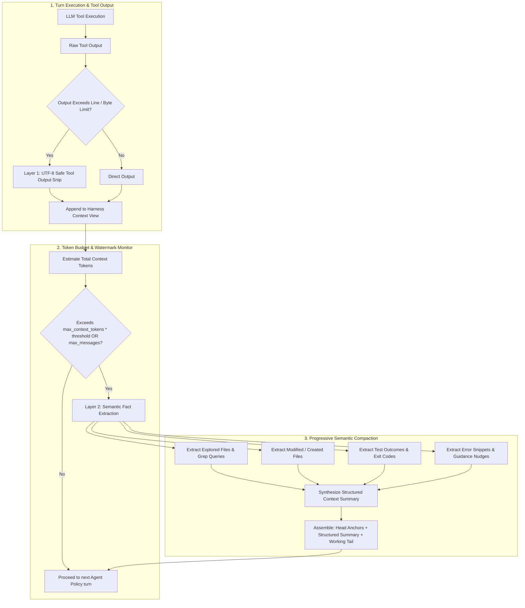

# OpenDuck Harness — Context Management & Semantic Progressive Compaction

## 1. Overview & Motivation

In long-running autonomous evaluation and coding benchmarks (e.g. SWE-bench, GAIA, real-world multi-file refactorings), agents execute 30 to 100+ turns involving file exploration, diff application, and test execution.

Traditional agent loops suffer from two critical failure modes in long trajectories:
1. **Context Length Overflow (400 Bad Request)**: Large file reads or massive test suite outputs (thousands of lines) suddenly exceed the model's physical token window (`context_limit`).
2. **Amnesia & Looping from Naive Truncation**: Sliding-window or head/tail truncation simply discards older conversation history. The agent forgets what files were already inspected, which hypotheses were disproven, and what code was previously modified, causing it to fall into repetitive exploratory loops and stagnation.

To solve both challenges, `openduck-harness` features a **Model-Aware Multi-Tiered Context Management & Semantic Progressive Compaction** architecture.



---

## 2. Architectural Pillars

### Pillar A: Model-Aware Token Budgeting & Estimation

`openduck-harness` aligns its compaction trigger directly with the underlying LLM's token capacity:

- **Token Estimator (`estimate_tokens`)**: Fast, deterministic estimation across message text, tool call signatures, arguments, and tool outputs (~3.5-4 chars per token plus structural overhead).
- **Watermark Thresholding**: Triggers compaction when `current_tokens > max_context_tokens * compaction_threshold` (default: 80% watermark).
- **Configuration Propagation**: `GooseAgentPolicy` automatically propagates `ModelConfig::context_limit` into `AgentHarness`.

### Pillar B: Layer 1 — Tool Output Snipping (`snip_tool_output`)

Before large tool results enter the conversation history:
- Line limits (e.g. default 200 lines) and byte limits (e.g. default 32 KB) are evaluated.
- The output is snipped symmetrically, preserving both the beginning (e.g. command echo and header) and the end (e.g. test summary, exit status, assertion stack trace).
- A clear omission notice is injected:
  ```
  [... 1420 lines omitted to preserve context headroom ...]
  ```
- Guaranteed UTF-8 character boundary safety prevents encoding corruption.

### Pillar C: Layer 2 & 3 — Semantic Fact Extraction & Progressive Compaction

When compaction is triggered:
1. **Preserve Context Anchors**:
   - **Head (First 2 messages)**: Task objective and system instructions are never dropped.
   - **Tail (Recent 4–8 messages)**: Active working memory of current step interactions is kept verbatim.
2. **Scan & Extract Facts from Intermediate Range**:
   - **Explored Files**: Extracted from `read_file`, `list_directory`, `search_files`, `grep_search`.
   - **Modified / Created Files**: Extracted from `write_file`, `edit_file`, patch scripts, and modifying commands.
   - **Execution Outcomes**: Captured test results (`cargo test`, `pytest`, exit codes).
   - **Key Errors & Diagnostic Traces**: Captured from error responses.
   - **Guidance & System Milestones**: Captured from anti-stagnation nudges and periodic reviews.
3. **Structured Progressive Summary Block**:
   A synthesized Markdown message replaces the intermediate messages:
   ```markdown
   [COMPACTED CONTEXT SUMMARY - Progressive History]
   Earlier interaction history (24 messages) was compacted to retain immediate context and preserve token budget.

   ### Explored Files & Search Queries:
   - crates/openduck/src/agents/agent.rs
   - crates/openduck-harness/src/runtime.rs
   - grep: fn prune_context_messages

   ### Modified / Created Files:
   - crates/openduck-harness/src/policy/context.rs
   - crates/openduck-harness/src/runtime.rs

   ### Test & Command Outcomes:
   - modifying: cargo test -p openduck-harness
   - test result: ok. 27 passed; 0 failed

   ### Guidance & System Milestones:
   - [MANDATORY PERIODIC REVIEW - STEP 15]: Review progress before proceeding.

   [Directive]: Use the summarized progress and recent immediate context below to continue the task.
   ```

---

## 3. Configuration API Reference

```rust
use openduck_harness::runtime::AgentHarness;

let harness = AgentHarness::new(policy, sandbox)
    // Model Context Window
    .with_context_limit(128_000)
    // Compaction watermark (80% of context limit = 102,400 tokens)
    .with_compaction_threshold(0.8)
    // Secondary message-count guardrail (defaults to 80)
    .with_max_context_messages(80)
    // Max lines and bytes per tool execution output
    .with_max_tool_output_limits(200, 32 * 1024)
    // Execution step limits
    .with_max_turns(30);
```

---

## 4. Verification & Testing

Unit and integration tests for context management are located in `crates/openduck-harness/tests/anti_stagnation_tests.rs`:
- `test_token_based_context_compaction`: Verifies token budget threshold triggers compaction even below message count limit.
- `test_semantic_structured_facts_extraction`: Verifies that file modifications, search queries, and error diagnostics are parsed into the summary.
- `test_tool_output_snipping_behavior`: Verifies line and byte output truncation behavior.
- `test_context_pruning`: Verifies backward compatibility of the pruning interface.
