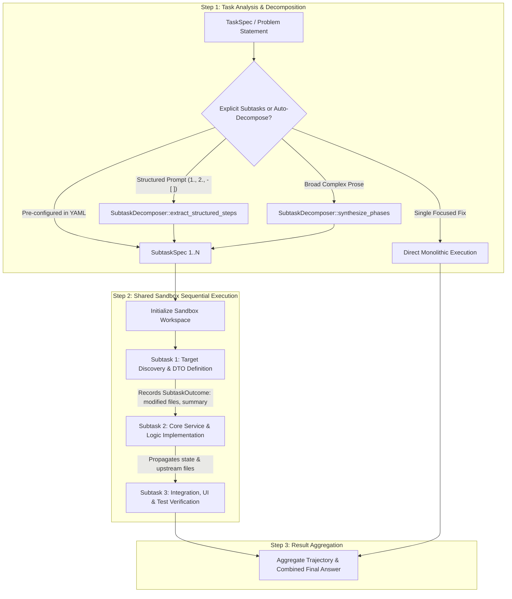

# OpenDuck Harness — Subtask Decomposition & Sequential Execution

## 1. Overview & Motivation

When autonomous coding agents tackle large, open-ended tasks (such as *"Complete all missing notification channels, database migrations, and UI components in docs/GPS_PLATFORM_PLAN.md"*), monolithic prompt execution frequently exhibits critical failure modes:

1. **Analysis Paralysis & Wandering**: The agent attempts to explore the entire repository at once, issuing dozens of read/search calls without applying any code edits.
2. **Loop Amnesia across Long Trajectories**: As turn counts grow and context compaction is triggered, earlier implementation details and intermediate discoveries can get blurred, causing the model to re-explore modules it already understood.
3. **Diff Conflicts & Fragmented Changes**: Without phased boundaries, the agent often attempts to edit service logic before defining the underlying DTOs or database models, leading to compilation errors and thrashing.

To resolve these issues, `openduck-harness` implements an automated **Subtask Decomposition & Sequential Execution Pipeline**.



---

## 2. Architectural Pillars

### Pillar A: Subtask Decomposition Engine (`SubtaskDecomposer`)

The `SubtaskDecomposer` evaluates the task's problem statement during initialization before beginning turn execution:

1. **Structured Step Extraction**:
   - Recognizes numbered lists (`1. `, `2. `), phase labels (`Step 1:`, `Phase A:`, `Task 1:`), and Markdown checklists (`- [ ]`, `* [ ]`).
   - Automatically extracts target file references (e.g. `*.rs`, `*.ts`, `*.vue`, `*.py`, `*.go`, `*.json`, `*.yaml`) associated with each subtask.
2. **Prose Heuristic Synthesis**:
   - For broad, multi-feature prose descriptions without explicit lists, the engine synthesizes a structured 3-phase plan:
     - **Phase 1**: Target Discovery, DTO & Interface Definition
     - **Phase 2**: Core Logic & Service Implementation
     - **Phase 3**: Integration, Verification & Test Suite
3. **Single-Task Fallback**:
   - For concise, single-target bug fixes (e.g. `"Fix null check in src/auth.rs"`), the decomposer returns an empty subtask set, allowing the task to run without subtask overhead.

---

### Pillar B: Shared Sandbox Sequential Execution

Subtasks are executed sequentially in the **exact same sandbox environment**:

- **Workspace State Continuity**: Files created or modified in Subtask 1 (e.g. `src/domain/dto/gps.rs`) remain in the workspace filesystem and are immediately available to Subtask 2 (`src/domain/services/gps_notify.rs`).
- **Scoped Budgets per Subtask**:
  - Each subtask has its own dedicated turn limit and exploration budget.
  - Auto-synthesized phases inherit a **2:3:2 split** of the parent task `maxTurns` (discovery : core implementation : verification), with a floor of 8 turns per phase. Optional `phaseMaxTurns: [p1, p2, p3]` overrides the split from YAML or the Hub task editor.
  - Repetitive call detectors and anti-stagnation counters reset per subtask, preventing stagnation flags from leaking across subtask boundaries.
- **Context Refresh**:
  - Subtask $N$ receives a focused, clean context view containing:
    1. The parent task's overall goal.
    2. The active subtask's title, description, and target files.
    3. A concise summary of completed upstream subtasks (modified files and key outputs).
  - This eliminates context clutter and prevents cumulative token bloat.

---

### Pillar C: Execution Outcome Tracking (`SubtaskOutcome`)

At the conclusion of each subtask, the harness captures:

```rust
pub struct SubtaskOutcome {
    pub subtask_id: String,
    pub title: String,
    pub status: RunStatus,
    pub modified_files: Vec<String>,
    pub summary: String,
    pub step_count: usize,
}
```

The outcome summary is forwarded into the prompt contract of all downstream subtasks:

```markdown
### Completed Upstream Subtasks:
- **Subtask [Completed] `task-subtask-1`**: Define DTOs
  - Modified Files: `src/domain/dto/gps.rs`
  - Summary: Defined GpsPayload and AlarmRuleDTO structs with serde annotations.
```

---

### Pillar D: Durable Failure and Continue-from-Checkpoint

Provider `NetworkError` / `ServerError` are retried at the HTTP layer, then twice more in `GooseAgentPolicy` with 5s/15s backoff. If the run still stops (`Failure`, `Cancelled`, `Timeout`):

- `policy.step` errors complete as `RunStatus::Failure` with the failed step recorded (the run is not aborted as `Err`).
- Sequential execution **stops** on Failure (not only Cancelled).
- A `ContinuationCheckpoint` is persisted on the history DTO: compacted progress summary, completed `SubtaskOutcome`s, resume subtask id, and the subtask plan.

Hub **Continue** starts a **new** run of the same task with `continueFromRunId`. It does **not** restore the old conversation. It skips completed subtasks and injects the compacted summary into the resume prompt. Extra turns apply to the in-progress subtask only.

---

## 3. Data Structures & Schema

### `SubtaskSpec`

```rust
#[derive(Debug, Clone, Serialize, Deserialize, PartialEq, Eq)]
#[serde(rename_all = "camelCase")]
pub struct SubtaskSpec {
    pub id: String,
    pub title: String,
    pub description: String,
    #[serde(default, skip_serializing_if = "Option::is_none")]
    pub target_files: Option<Vec<String>>,
    #[serde(default, skip_serializing_if = "Option::is_none")]
    pub max_turns: Option<usize>,
    #[serde(default, skip_serializing_if = "Option::is_none")]
    pub exploration_budget: Option<usize>,
}
```

### `TaskSpec` Configuration Fields

```rust
pub struct TaskSpec {
    pub id: String,
    pub dataset: String,
    pub problem_statement: String,
    pub max_turns: Option<usize>,
    pub exploration_budget: Option<usize>,
    pub subtasks: Option<Vec<SubtaskSpec>>,
    pub auto_decompose: Option<bool>,
    pub phase_max_turns: Option<Vec<usize>>,
    // ...
}
```

---

## 4. Configuration Examples

### Explicit Subtasks in Project Task YAML (`.goose/tasks/gps-feature.yaml`)

```yaml
id: task-gps-notifications
name: "Implement GPS Notification Feature"
category: "feature"
autoDecompose: false
prompt: "Implement full end-to-end GPS alarm notification pipeline"
subtasks:
  - id: "subtask-1-dto"
    title: "Define DTOs & Models"
    description: "Create GpsPayload and AlarmNotificationDTO in rmqx_admin/src/domain/dto/gps.rs"
    targetFiles:
      - "rmqx_admin/src/domain/dto/gps.rs"
    maxTurns: 8
    explorationBudget: 3

  - id: "subtask-2-service"
    title: "Implement Dispatcher Service"
    description: "Implement SmsDispatcher and WebhookDispatcher in rmqx_admin/src/domain/services/gps_notify.rs"
    targetFiles:
      - "rmqx_admin/src/domain/services/gps_notify.rs"
    maxTurns: 12
    explorationBudget: 4

  - id: "subtask-3-verify"
    title: "Run Integration Tests"
    description: "Run cargo test -p rmqx_admin and verify all test cases pass"
    maxTurns: 6
    explorationBudget: 2
```

### Auto-synthesized phases inherit parent Max Turns

```yaml
id: task-957723
name: GPS Platform 2
maxTurns: 500
autoDecompose: true
# Optional. When omitted, phases get a 2:3:2 split of maxTurns (142 / 216 / 142 for 500).
phaseMaxTurns: [80, 200, 220]
prompt: '@docs/GPS_PLATFORM_PLAN.md complete unimplemented features, add e2e tests, generate a screenshot report.'
```

### Web Hub Dashboard UI Configuration

In the **Web Hub Project Dashboard** (`http://localhost:8015` or your local hub port):
1. Navigate to the project's **Harness** tab.
2. Under **Project Tasks**, click **+ New Task** (or edit an existing task).
3. In the task editor modal:
   - Below **Max Turns** and **Timeout (Seconds)**, you will see the **Auto-Decompose Task into Sequential Subtasks (Recommended)** checkbox.
   - **Enabled (Default)**: Automatically splits multi-step prompts or complex feature requests into sequential phases. **Per-phase Max Turns** inputs appear under the checkbox; they default to a 2:3:2 split of parent Max Turns and can be overridden. Changing parent Max Turns re-splits unless you then edit a phase.
   - **Disabled**: Runs the task in monolithic single-turn mode without subtask decomposition.
4. Click **💾 Save Task** to persist the configuration (including `phaseMaxTurns`) into `.goose/tasks/{task_id}.yaml`.

---

## 5. Verification & Testing

The subtask decomposition and sequential execution capabilities are validated by automated test suites in `crates/openduck-harness/tests/subtask_tests.rs`:

- `test_subtask_decomposition_from_numbered_list`: Validates extraction of ordered subtasks and associated target file paths from numbered prompts.
- `test_subtask_decomposition_from_markdown_checklist`: Validates extraction from checklist-style prompts (`- [ ]`).
- `test_subtask_decomposition_for_complex_prose`: Validates 3-phase synthesis on broad problem statements (28 parent turns → 8/12/8).
- `test_synthesized_phases_split_parent_max_turns`: Parent `maxTurns` is split 2:3:2 (500 → 142/216/142).
- `test_synthesized_phases_honor_phase_max_turns_overrides`: YAML / Hub `phaseMaxTurns` overrides the split.
- `test_sequential_subtask_execution_in_shared_sandbox`: Validates end-to-end multi-step execution in a shared workspace where Subtask 1 creates types, Subtask 2 consumes them, and Subtask 3 verifies the build.
