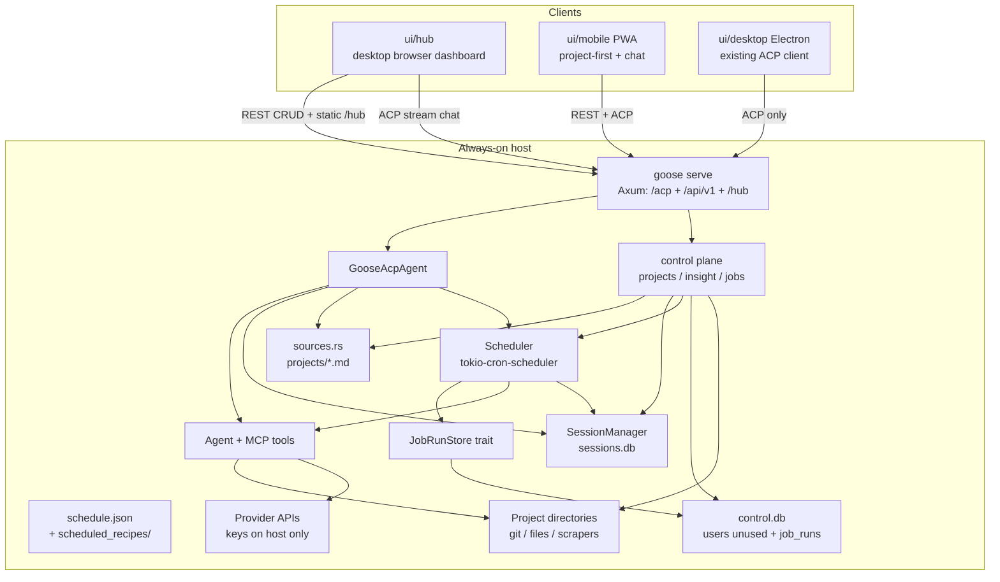
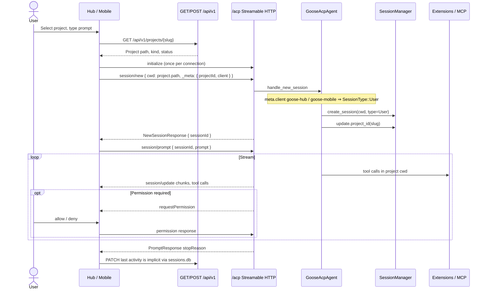
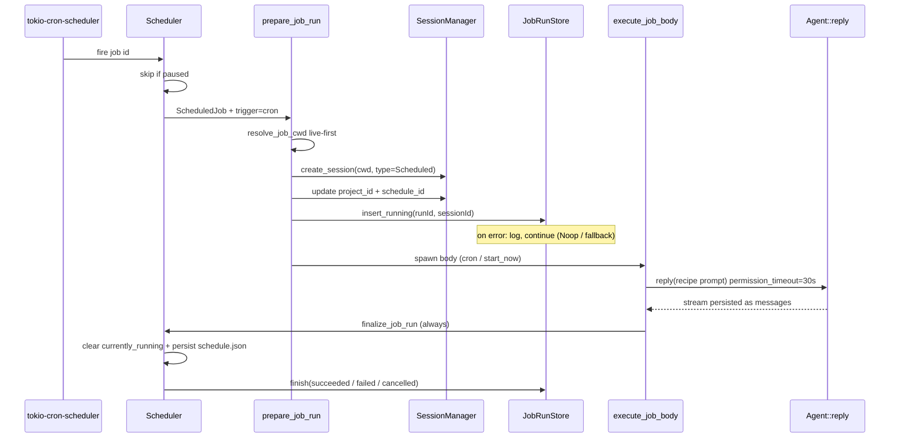
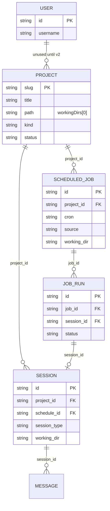

# Personal Agent System — Implementation Plan

| Field | Value |
|---|---|
| **Title** | Personal Agent System |
| **Author** | TBD |
| **Date** | 2026-08-13 |
| **Status** | Draft |
| **Audience** | Goose core / desktop / mobile engineers |
| **Workspace** | `/mnt/e/goose` |

This document is an implementation plan, not a greenfield product spec. It extends the existing `goose serve` ACP server, `SourceType::Project` store, in-process `Scheduler`, and `ui/mobile` PWA. An engineer should be able to implement from this document without inventing endpoints, tables, or a second agent protocol.

---

## Overview

A permanently-running host already has goose installed and can run `goose serve` (ACP over HTTP + Streamable HTTP/SSE + WebSocket, auth via `GOOSE_SERVER__SECRET_KEY`). The same machine holds multiple project directories: software repos, document trees, and automation/scrape working dirs. Today there is no first-class **project dashboard**: the CLI tracks recent cwd in `projects.json`, Desktop groups sessions by `working_dir`, ACP can CRUD markdown project sources, and `ui/mobile` is a chat-only thin client.

This plan adds a **Personal Agent System** on that host: register projects (directory + metadata), inspect a project (contents, git, recent agent/job activity), send a prompt that runs in that project's cwd with live streaming, and schedule per-project jobs (tests, scrapes, document updates, headless recipes). Two frontends share one backend: a **web dashboard** (desktop browser) and a **mobile PWA** (evolve `ui/mobile`).

**Product shape:** extend goose in-repo. The always-on process is `goose serve`. The dashboard and phone are thin ACP + REST clients. Tools, provider keys, and file I/O stay on the host. We do **not** spawn `goose` CLI subprocesses and we do **not** invent a parallel agent protocol.

---

## Background & Motivation

### Current state (what already exists)

Goose already separates **interface / agent / extensions** (`CUSTOM_DISTROS.md`, `REMOTE_MOBILE_GOOSE_DESIGN.md`). Relevant pieces:

| Piece | Location | What it does | Gap vs this product |
|---|---|---|---|
| `goose serve` | `crates/goose-cli/src/cli.rs` `Command::Serve`, `handle_serve_command` | ACP HTTP router on `--host/--port`, optional `--tls`, `--allowed-origin` | No project dashboard, no REST control plane, does not serve a web UI |
| ACP transport | `crates/goose/src/acp/transport/mod.rs` | `/acp` Streamable HTTP + WS, `/status`, `/health`, MCP app proxy | Fine as-is for chat streaming |
| Auth | `crates/goose/src/acp/transport/auth.rs` | `X-Secret-Key` or `?token=` constant-time compare | Single shared secret; no users |
| Session create | `crates/goose/src/acp/server/new_session.rs` | `session/new` requires **absolute existing cwd**; optional `meta.projectId` | Desktop does not yet pass `projectId`; mobile cwd is a free-text field |
| Session list | `crates/goose/src/acp/server/list_sessions.rs` | Filter by `cwd`, keyword, type (`user`/`scheduled`/`acp`) | **No `project_id` filter** |
| Sessions DB | `crates/goose/src/session/session_manager.rs` | SQLite `sessions.db` schema v15; `Session.project_id` already exists | `project_id` is optional and unused by list filters |
| Project sources | `crates/goose/src/sources.rs` | `<dataDir>/projects/<slug>.md` via `_goose/unstable/sources/*` | Properties bag is untyped; no kind/language/status/tags; no git/dir insight |
| CLI tracker | `crates/goose-cli/src/project_tracker.rs` | `projects.json` keyed by path: `last_accessed`, `last_instruction`, `last_session_id` | No name/type/tags/status; CLI-only; parallel to markdown sources |
| Scheduler | `crates/goose/src/scheduler.rs` + `scheduler_trait.rs` | In-process `tokio-cron-scheduler`; persist `schedule.json`; jobs run recipes | **No `project_id`**. `execute_job` uses `std::env::current_dir()` — not the project cwd |
| Schedule ACP | `crates/goose-sdk-types/src/custom_requests/schedule.rs`, `crates/goose/src/acp/server/schedule.rs` | `_goose/unstable/schedules/{list,create,delete,update,run-now,pause,unpause,sessions/list,running-job/*}` | Same: no project binding |
| Desktop schedules | `ui/desktop/src/components/schedule/*`, `ui/desktop/src/acp/schedules.ts` | Full schedule CRUD UI over ACP | Desktop-only; not per-project |
| Desktop session grouping | `ui/desktop/src/utils/projectSessions.ts` | Groups by `workingDir` basename | Not registered projects |
| Mobile PWA | `ui/mobile` | Chat, sessions, tool cards, permission modal | **Not a project dashboard** |
| TS SDK | `ui/sdk` `@aaif/goose-sdk` | `GooseClient`, `createHttpStream({ secretKey })` | Ready for dashboard chat |
| Agent project context | `Agent::load_project_instructions` in `crates/goose/src/agents/agent.rs` | Injects project markdown into the prompt when `session.project_id` is set | Requires `projectId` on session create |

### Pain points

1. **No operator surface for "my projects on this box."** Registering a repo, seeing git dirty state, and kicking a prompt from a phone requires ad-hoc cwd typing.
2. **Two incomplete project models.** CLI `projects.json` vs ACP `SourceType::Project` markdown. Neither has type/language/tags/status.
3. **Scheduled jobs are global and cwd-wrong.** `execute_job` (`crates/goose/src/scheduler.rs` ~L1027) creates the scheduled session with `std::env::current_dir()?`, and ~L1036–1037 discovers plugin MCP servers with a second `current_dir()` call — for a systemd `goose serve` that is typically the service working directory, not the repo under test.
4. **Mobile is chat-only.** `REMOTE_MOBILE_GOOSE_DESIGN.md` explicitly scoped P1 to connect/chat/permissions. Project list, detail, and jobs are out of that spike.
5. **Desktop is Electron.** The always-on box needs a **browser** dashboard, not another Desktop window.

### Why now

The protocol, auth, session store, source CRUD, and scheduler are already in-process in `goose serve`. The missing work is a **control plane + UI**, plus a few targeted backend gaps (`project_id` on jobs, cwd for scheduled runs, project insight, session list by project).

---

## Goals & Non-Goals

### Goals

1. Register, edit, delete, and list **projects**. Each project maps to one primary absolute directory on the host and carries slug, title, description, kind, language, status, tags.
2. Project **detail**: directory summary, git status (if a repo), recent sessions, recent job runs, recent logs.
3. From web or mobile, send a **prompt** bound to a project. The agent runs on the host with `cwd = project.path`. Tokens, tool calls, and permission requests stream back over existing ACP.
4. Per-project **scheduled jobs** (cron-like) that run a recipe / headless prompt in that project's cwd. Track status, logs, history.
5. Two frontends, one backend: desktop-browser dashboard + mobile PWA.
6. Always-on via `systemd`/`launchd` wrapping `goose serve`. Remote access via LAN or Tailscale. Provider keys stay on the host.

### Non-Goals (v1)

- Multi-user OAuth / RBAC / per-user project ACLs (schema reserved; unused).
- Public internet port-forward as a product. No marketplace tunnel.
- Native iOS/Android apps, cert pinning, push notifications (P2+).
- Agent-on-phone (archived goose Mobile).
- Recreating `ui/desktop/src/api` or adding `@hey-api/openapi-ts` in desktop.
- A second language/runtime for the control plane (no Node/Python backend).
- Redis, Celery, Temporal, Sidekiq, or any external queue.
- Inventing SSE-as-a-new-product or a new agent wire protocol.
- Spawning `goose run` / `goose session` subprocesses for interactive or scheduled work.
- Full extension-management UI, recipe visual editor, or Desktop feature parity.
- Branding, custom domain, or hosted SaaS.

---

## Key Decisions

| # | Decision | Rationale |
|---|---|---|
| K1 | **Extend goose in-repo.** The product is `goose serve` + new control-plane routes + `ui/hub` (web) + evolve `ui/mobile`. Not a sibling process that shells out to the CLI. | `CUSTOM_DISTROS.md` already says custom UIs talk ACP to `goose serve`. Scheduler, sessions, sources, and auth are in-process. A second runtime would duplicate secrets, cwd, and job state. |
| K2 | **ACP for agent sessions; REST for dashboard CRUD.** Chat/stream/permissions stay on `/acp`. Projects, insight, and job CRUD also get `/api/v1/*` on the same Axum router. ACP custom methods remain for Desktop/TUI. | Prompt asked for REST + realtime. ACP Streamable HTTP is already the realtime transport (`ui/sdk/src/http-stream.ts`). REST avoids forcing a full ACP session just to list projects from a dashboard table. Both call the same Rust services. |
| K3 | **Do not spawn goose CLI subprocesses.** Interactive prompts use `session/new` + `session/prompt`. Scheduled work uses in-process `prepare_job_run` / `execute_job_body` (fixed to honor project cwd). | Subprocesses lose ACP streaming, permission callbacks, and the sessions DB write path. `GooseAcpAgent` and `Scheduler` already do this in-process. |
| K4 | **Canonical project identity = filename stem** of `<dataDir>/projects/<slug>.md`. YAML `name:` is display, not the slug. Typed keys: `workingDirs`, `kind`, `status`, optional `language`/`tags`/`title`. CLI `projects.json` is a compatibility index. | Matches `sources.rs` today. Validating YAML `name:` as kebab-case would reject existing `name: Acme API` files. |
| K5 | **`control.db` holds unused `users` + a `job_runs` index.** Sessions stay in `sessions.db` (messages remain the logs). Jobs stay in `schedule.json`. Scheduler never imports `control::`. It takes an `Arc<dyn JobRunStore>` at construction (CLI/tests use `NoopJobRunStore`). | Avoids a `ControlState ↔ Scheduler` cycle. If `job_runs` insert fails, the job still runs; history falls back to `sessions.schedule_id`. |
| K6 | **Realtime = existing ACP Streamable HTTP (SSE GET + JSON POST), not a new WebSocket product and not a new SSE API.** Optional WS upgrade already exists on `/acp`. | `createHttpStream` already implements connection-scoped + session-scoped SSE. Desktop and mobile already consume it. A third stream would desync tool/permission UX. |
| K7 | **Mobile = PWA.** One responsive React app family (`ui/hub` + evolve `ui/mobile`). No React Native / Flutter in v1. | `ui/mobile` is the P1 spike. Browser cannot pin certs; Tailscale + TLS is the v1 security story. Native shell is v2+ if pinning/secure storage is required. |
| K8 | **Single-user first.** Auth = `GOOSE_SERVER__SECRET_KEY`. Anyone with the secret is the operator. Remote access: Tailscale/VPN recommended; LAN OK; public port-forward discouraged. | Matches `REMOTE_MOBILE_GOOSE_DESIGN.md` and current `auth.rs`. Multi-user is a later auth middleware swap, not a v1 requirement. |
| K9 | **Provider keys and tools stay on the host.** Phone/browser never receive OpenAI/Anthropic keys. Tools execute as the host user in the project cwd. | Existing remote-serve contract. Permission modal remains security-critical. |
| K10 | **In-process `tokio-cron-scheduler`.** No Redis/Celery. Always-on `goose serve` **is** the scheduler process (already started in `AcpServer::scheduler()`). | Temporal was already removed (`crates/goose-cli/src/commands/schedule.rs` deprecation messages). Adding a broker is unjustified for one operator. |
| K11 | **Fix every `current_dir()` in `execute_job`.** Resolve one `PathBuf` (live project path first, then stored `working_dir`, else error) and use it for `create_session`, `enabled_plugin_mcp_servers`, and any `create_with_working_dir`. Never silently use process cwd. | Session cwd-only would still load plugins from the systemd unit directory (~L1036). |
| K12 | **Web dashboard is first-class.** New `ui/hub` SPA served by `goose serve` at `/hub` (unauthenticated static + `index.html` fallback). Mobile grows project/job screens; chat is a child view of a project. | Desktop Electron is not the always-on operator UI. |
| K13 | **Dashboard run-now is fire-and-forget.** Add `SchedulerTrait::start_now` → `202 { runId, sessionId }`. Existing `run_now` stays synchronous for ACP/CLI. Both, plus cron, **must** call `finalize_job_run` so `currently_running` is released. | Today's `run_now` awaits `execute_job`; blocking HTTP for `cargo test` is unusable. Cleanup today lives in `run_now`/cron, not in `execute_job`. |
| K14 | **Scheduled permissions fail closed after 30s.** `SessionConfig.permission_timeout = Some(30s)` on scheduled runs. Do **not** switch cron jobs to `GooseMode::Auto`. | `tool_confirmation_router` oneshot has no timeout; no ACP modal exists on this path. A hang would hold `currently_running` forever. |
| K15 | **Hub/mobile sessions are `SessionType::User`.** Clients **must** send `_meta.client` (`goose-hub` / `goose-mobile`). `projectId` is independent of `client`. | `new_session.rs`: any `meta.client` ⇒ `User`; missing `client` ⇒ `Acp`. Desktop lists `user`/`scheduled` only. |

---

## Proposed Design

### Architecture overview



**Process model.** One long-lived `goose serve` under systemd/launchd. `AcpServer::scheduler()` (`crates/goose/src/acp/server_factory.rs`) starts `Scheduler::new(data_dir/schedule.json, SessionManager, job_run_store)`. CLI `goose schedule` passes `NoopJobRunStore`. That serve process is the only agent/scheduler. Clients are browsers. **`control` must not be imported by `scheduler.rs`.**

**Do not** run a second `goose schedule` CLI loop. CLI schedule commands construct their *own* `Scheduler` against the same `schedule.json` — that is a footgun if `goose serve` is also running. v1 ops rule: **when the personal agent host is up, all schedule mutations go through the serve process** (REST/ACP). CLI schedule commands should detect a running serve (optional later) or remain local-dev only.

### Component responsibilities

| Component | Responsibility |
|---|---|
| `ui/hub` | Project list/detail, prompt box, job editor, run history. Desktop-browser first. |
| `ui/mobile` | Same capabilities, phone layout. Chat + permissions reused from the P1 spike. |
| `@aaif/goose-sdk` | ACP client (`GooseClient`, `createHttpStream`). Add generated types for new custom methods. |
| `goose serve` router | Existing `/acp`, `/status`, `/health`. New `/api/v1/*`, static `/hub`. Same auth middleware. |
| `crates/goose/src/control/` | Typed project helpers, insight, REST. Implements `JobRunStore` for `control.db`. Does **not** own `Scheduler`. |
| `sources.rs` | Keep markdown CRUD; validate typed project properties. YAML `name:` is display, not slug. |
| `scheduler.rs` | `project_id` + cached `working_dir`; live-path-first cwd; `start_now`; `JobRunStore` callbacks; `update_job_recipe`. |
| `SessionManager` | Add `project_id` to `SessionListFilters`. |
| systemd unit | Restart=always; `EnvironmentFile` for secret; working directory irrelevant after K11. |

### Data flow — send a prompt from the UI



Implementation anchors:

- `validate_absolute_cwd` in `crates/goose/src/acp/server.rs` — cwd must be absolute and exist.
- `meta_string(args.meta, "projectId")` in `new_session.rs` — independent of `client`.
- `meta_string(args.meta, "client")` — **any** `Some(_)` ⇒ `SessionType::User`; `None` ⇒ `SessionType::Acp`. Hub **must** send `client: "goose-hub"`; mobile **must** send `client: "goose-mobile"`. Desktop already sends `goose-desktop` and lists `types: ['user','scheduled']`, so `Acp` hub sessions would be invisible there.
- Streaming: `ui/sdk/src/http-stream.ts` opens a session-scoped GET SSE (`Acp-Session-Id`) then POSTs `session/prompt`.
- Permissions: mobile `PermissionModal.tsx` / Desktop equivalent; dashboard must implement the same `GooseClientCallbacks.requestPermission`.

### Data flow — scheduled job



`Scheduler.sessions(sched_id, limit)` already returns those sessions for the Desktop "schedule detail" view. Project detail reuses the same list, filtered by `project_id`.

### Scheduled job execution contract

This section is the implementer spec for Issues that were previously implied. Do not invent a second write path.

#### Cwd resolution (single `PathBuf`, used everywhere)

```rust
fn resolve_job_cwd(job: &ScheduledJob) -> Result<PathBuf, SchedulerError> {
    // 1. Live project path wins (path PATCH must take effect on the next fire).
    if let Some(slug) = job.project_id.as_deref() {
        if let Some(path) = crate::sources::project_working_dirs(slug).into_iter().next() {
            return Ok(PathBuf::from(path));
        }
    }
    // 2. Cached snapshot (job created with an explicit dir, or project was deleted).
    if let Some(path) = job.working_dir.as_deref().filter(|p| !p.is_empty()) {
        let p = PathBuf::from(path);
        if p.is_absolute() && p.is_dir() {
            return Ok(p);
        }
    }
    Err(SchedulerError::AnyhowError(anyhow!(
        "Job '{}' has no resolvable working directory",
        job.id
    )))
}
```

Call `resolve_job_cwd` **once** at the top of `prepare_job_run`. Pass that `PathBuf` to:

- `session_manager.create_session(cwd, …)`
- `enabled_plugin_mcp_servers(Some(cwd.as_path()))` (today ~L1036 uses `std::env::current_dir()`)
- any `create_with_working_dir(..., cwd)`

Never call `std::env::current_dir()` in this path.

#### `JobRunStore` (breaks the control ↔ scheduler cycle)

```rust
// crates/goose/src/scheduler.rs (or a sibling job_run_store.rs)

#[derive(Clone, Copy)]
pub enum JobRunTrigger { Cron, Manual }

#[derive(Clone, Copy)]
pub enum JobRunTerminal { Succeeded, Failed, Cancelled }

#[async_trait]
pub trait JobRunStore: Send + Sync {
    async fn insert_running(
        &self,
        run_id: &str,
        job_id: &str,
        project_id: Option<&str>,
        session_id: &str,
        trigger: JobRunTrigger,
        started_at: DateTime<Utc>,
    ) -> anyhow::Result<()>;

    async fn finish(
        &self,
        run_id: &str,
        status: JobRunTerminal,
        finished_at: DateTime<Utc>,
        error: Option<String>,
    ) -> anyhow::Result<()>;
}

pub struct NoopJobRunStore;

#[async_trait]
impl JobRunStore for NoopJobRunStore {
    async fn insert_running(&self, _: &str, _: &str, _: Option<&str>, _: &str, _: JobRunTrigger, _: DateTime<Utc>) -> anyhow::Result<()> { Ok(()) }
    async fn finish(&self, _: &str, _: JobRunTerminal, _: DateTime<Utc>, _: Option<String>) -> anyhow::Result<()> { Ok(()) }
}
```

`SqliteJobRunStore` lives in `crates/goose/src/control/jobs.rs` and writes `control.db`. `scheduler.rs` must not `use crate::control`.

Constructor change (`AcpServer::scheduler` in `server_factory.rs`):

```rust
pub async fn new(
    storage_path: PathBuf,
    session_manager: Arc<SessionManager>,
    job_run_store: Arc<dyn JobRunStore>,
) -> Result<Arc<Self>, SchedulerError> { /* … */ }

Every `Scheduler::new` call site must pass a store. Miss one and it will not compile:

| Call site | Store |
|---|---|
| `crates/goose/src/acp/server_factory.rs` `AcpServer::scheduler()` | `SqliteJobRunStore` (`control.db`) |
| `crates/goose/src/execution/manager.rs` ~L77 `AgentManager::instance()` | `SqliteJobRunStore` if this process is the live scheduler; else `NoopJobRunStore` |
| `crates/goose-cli/src/commands/schedule.rs` (add/list/remove/sessions/run-now) | `NoopJobRunStore` |
| `crates/goose/src/scheduler.rs` unit tests | `NoopJobRunStore` |

```rust
// serve (server_factory.rs):
let job_run_store = Arc::new(SqliteJobRunStore::open(data_dir.join("control.db")).await?);
Scheduler::new(schedule_file_path, session_manager, job_run_store)

// execution/manager.rs AgentManager::instance() and CLI schedule.rs:
Scheduler::new(path, session_manager, Arc::new(NoopJobRunStore))
```

**Write path / crash rules:**

1. Create session **first**.
2. `insert_running` **immediately after** `create_session` + stamp `project_id`/`schedule_id`. If insert fails: `tracing::error!`, keep `run_id` locally as `None`, **do not abort the job**. History is then `sessions.schedule_id`.
3. `JobRunStore::finish` is called **only from `finalize_job_run`**, never from `execute_job_body`. Map `cancel_token.is_cancelled()` → `Cancelled`; `Err` → `Failed` with `error = e.to_string()`; `Ok` → `Succeeded`. Skip `finish` when `run_id` insert failed (`None`).
4. Dual-write inconsistency is acceptable: a session without a `job_runs` row still appears in `GET /jobs/{id}/runs` via a union query (see REST).

#### Split `execute_job` so `start_now` can return immediately

Today `run_now` (~L784) **awaits** `execute_job` (~L811) and only then returns the session id. ACP `_goose/unstable/schedules/run-now` therefore blocks until the recipe ends. That must stay for Desktop/CLI.

Extract **three** pieces. Today the post-run cleanup lives in `run_now` (~L821–835) and the cron closure (~L377–393), **not** in `execute_job`. If `start_now` only spawns the body, `currently_running` sticks true forever: later `start_now`/`run_now` 409, cron skips, `kill_running_job` sees a stale token. `JobRunStore::finish` does **not** write `schedule.json`.

```rust
struct PreparedJobRun {
    run_id: Option<String>,  // None if insert_running failed
    session_id: String,
    cwd: PathBuf,
    job: ScheduledJob,
    cancel_token: CancellationToken,
}

impl Scheduler {
    async fn prepare_job_run(
        &self,
        job: ScheduledJob,
        trigger: JobRunTrigger,
    ) -> Result<PreparedJobRun, SchedulerError> { /* resolve cwd, create session, insert_running */ }

    /// Recipe load + Agent::reply only. Does **not** touch running_tasks or schedule.json.
    async fn execute_job_body(&self, prepared: &PreparedJobRun) -> Result<String, SchedulerError> {
        // recipe load, Agent::new, extensions from prepared.cwd,
        // SessionConfig { permission_timeout: Some(Duration::from_secs(30)), schedule_id, … }
        // Agent::reply; return session_id
    }

    /// ALWAYS run after the body, including panic-equivalent early returns.
    /// Mirrors today's run_now (~L821–835) and cron closure (~L377–393).
    async fn finalize_job_run(
        &self,
        job_id: &str,
        prepared: &PreparedJobRun,
        body: Result<String, SchedulerError>,
    ) -> Result<String, SchedulerError> {
        self.running_tasks.lock().await.remove(job_id);

        {
            let mut jobs = self.jobs.lock().await;
            if let Some((_, job)) = jobs.get_mut(job_id) {
                job.currently_running = false;
                job.current_session_id = None;
                job.process_start_time = None;
                job.last_run = Some(Utc::now());
            }
        }
        persist_jobs(&self.storage_path, &self.jobs).await?;

        let terminal = if prepared.cancel_token.is_cancelled() {
            JobRunTerminal::Cancelled
        } else if body.is_err() {
            JobRunTerminal::Failed
        } else {
            JobRunTerminal::Succeeded
        };
        if let Some(run_id) = prepared.run_id.as_deref() {
            let error = match &body {
                Err(e) if !prepared.cancel_token.is_cancelled() => Some(e.to_string()),
                _ => None,
            };
            if let Err(e) = self.job_run_store.finish(run_id, terminal, Utc::now(), error).await {
                tracing::error!(job_id, error = %e, "JobRunStore::finish failed");
            }
        }

        match body {
            _ if prepared.cancel_token.is_cancelled() => Err(SchedulerError::AnyhowError(anyhow!(
                "Job '{job_id}' was successfully cancelled"
            ))),
            Ok(session_id) => Ok(session_id),
            Err(e) => Err(e),
        }
    }

    async fn run_prepared(
        &self,
        prepared: PreparedJobRun,
    ) -> Result<String, SchedulerError> {
        let body = self.execute_job_body(&prepared).await;
        self.finalize_job_run(&prepared.job.id, &prepared, body).await
    }

    /// Existing: wait until the recipe finishes. Returns session id.
    pub async fn run_now(&self, id: &str) -> Result<String, SchedulerError> {
        let prepared = self.mark_running_and_prepare(id, JobRunTrigger::Manual).await?;
        self.run_prepared(prepared).await
    }

    /// NEW: return as soon as the session + job_runs(running) row exist.
    pub async fn start_now(&self, id: &str) -> Result<StartNowResult, SchedulerError> {
        let prepared = self.mark_running_and_prepare(id, JobRunTrigger::Manual).await?;
        let result = StartNowResult {
            run_id: prepared.run_id.clone().unwrap_or_default(),
            session_id: prepared.session_id.clone(),
        };
        let this = /* Arc<Self> — same pattern as cron spawn */;
        tokio::spawn(async move {
            let _ = this.run_prepared(prepared).await; // body THEN finalize — never body alone
        });
        Ok(result)
    }
}

pub struct StartNowResult {
    pub run_id: String,
    pub session_id: String,
}
```

Add to `SchedulerTrait`:

```rust
async fn start_now(&self, id: &str) -> Result<StartNowResult, SchedulerError>;
```

Cron fire uses `prepare_job_run` + `tokio::spawn(run_prepared)` — **not** `execute_job_body` alone. `mark_running_and_prepare` keeps the existing `currently_running` exclusive lock. If prepare fails **after** the lock is taken, call `finalize_job_run` immediately so the lock is released.

`finalize_job_run` is the **only** place that clears `currently_running`. Callers:

| Path | After body |
|---|---|
| `run_now` (ACP/CLI, waits) | `run_prepared` → finalize |
| `start_now` spawn (REST 202) | `run_prepared` → finalize |
| Cron closure | `run_prepared` → finalize |

ACP: keep `run_now` (wait). Optionally later add `wait: bool` to `RunScheduleNowRequest` (default `true`). Hub REST **must** call `start_now`, not `run_now`.

#### Permission policy (v1, not an open question)

Scheduled runs use `Agent::new()` — there is no ACP `requestPermission` callback. `ToolConfirmationRouter::register` (~`tool_execution.rs` L103) then `confirmation_rx.await` (L127) **has no timeout**. Under host `GOOSE_MODE=approve` / `smart_approve`, a `shell` tool hangs and leaves `currently_running = true`.

**Decision:** fail closed after **30 seconds**. Do not set `GooseMode::Auto` on cron jobs.

```rust
// SessionConfig (session path used by Agent::reply)
pub permission_timeout: Option<Duration>, // None = wait forever (interactive ACP)

// execute_job_body:
let session_config = SessionConfig {
    id: session.id.clone(),
    schedule_id: Some(job.id.clone()),
    max_turns: None,
    retry_config: None,
    permission_timeout: Some(Duration::from_secs(30)),
};

// tool_execution.rs, replace bare confirmation_rx.await:
let confirmation = match session_config.permission_timeout {
    Some(limit) => tokio::time::timeout(limit, confirmation_rx)
        .await
        .map_err(|_| anyhow::anyhow!(
            "Permission required for tool `{tool}` but no operator was present. \
             Scheduled runs fail closed after 30s. Approve the tool from an \
             interactive session (Always Allow) or restrict the recipe.",
            tool = tool_call.name
        ))??,
    None => confirmation_rx.await?,
};
```

On timeout: `execute_job_body` returns `Err` with that message. **`run_prepared` then calls `finalize_job_run`**, which clears `currently_running` / `running_tasks` and `JobRunStore::finish(..., Failed, Some(that message))`. Do not assume the cancel token alone releases the exclusive lock. Recipes that need unapproved tools are **expected to fail**, not hang.

Interactive hub/mobile keep `permission_timeout: None` (existing modal).

### Host keep-alive

Linux (illustrative; secret via `EnvironmentFile` mode 600):

```ini
# /etc/systemd/system/goose-serve.service
[Unit]
Description=goose personal agent (ACP + hub)
After=network-online.target

[Service]
Type=simple
User=YOUR_USER
EnvironmentFile=/etc/goose/serve.env
ExecStart=/usr/local/bin/goose serve --platform desktop --host 0.0.0.0 --port 3000 --tls \
  --allowed-origin https://goose-host:3000 \
  --allowed-origin http://127.0.0.1:5173
Restart=always
RestartSec=3

[Install]
WantedBy=default.target
```

`serve.env`:

```
GOOSE_SERVER__SECRET_KEY=...
# Provider keys already in ~/.config/goose/config.yaml — do not duplicate here
```

Join the host to Tailscale. Phone and laptop use `https://<magicdns>:3000/hub`.

---

## Tech Stack Recommendations

| Layer | Choice | Why | Rejected |
|---|---|---|---|
| Backend | **Rust / existing Axum `goose serve`** | Auth, ACP, scheduler, sessions, sources already here. One process, one secret, one cwd. | Second backend (Go/Node/Python): splits state and secrets. |
| Agent runtime | **In-process `GooseAcpAgent` + `Scheduler`** | No CLI subprocess. Streaming and permissions work. | `goose run` / `goose session` child processes. |
| Control-plane API | **Axum REST `/api/v1` + ACP custom methods** | Dashboard tables are REST; chat is ACP. Shared Rust services. | REST-only (loses ACP streaming). ACP-only (awkward for simple CRUD from `fetch`). |
| Realtime | **Existing ACP Streamable HTTP (SSE)** | Already implemented and used by Desktop + mobile. WS upgrade exists on `/acp` for clients that want it. | New SSE `/events` bus. Dedicated WS gateway. WebTransport. |
| Project metadata store | **Markdown sources (`<dataDir>/projects/<slug>.md`)** | Already CRUD'd over ACP; agent loads instructions from it. | New `projects` SQL table as source of truth (forks identity). Keep properties typed. |
| Sessions / logs | **Existing `sessions.db` SQLite** | Messages *are* the run logs. `session_type`, `schedule_id`, `project_id` already columns. | Separate log files per job. |
| Job definitions | **Existing `schedule.json` + `scheduled_recipes/`** | `Scheduler` already persists here. Add fields; don't rewrite. | Redis / extra SQL jobs table in MVP. |
| Users / job-run index | **New `control.db` SQLite** next to `sessions.db` | Tiny; `users` reserved; `job_runs` written only through `JobRunStore`. | Scheduler importing `control`. Postgres. |
| Scheduler | **In-process `tokio-cron-scheduler`** | Already in `Scheduler`. Same process as serve. | Redis+worker, Celery, Temporal (already removed). |
| Web dashboard | **React 19 + Vite + TypeScript** in `ui/hub` | Matches `ui/mobile` and `ui/desktop` renderer. Workspace already pnpm. | Svelte/Vue (new stack). Next.js (SSR unnecessary on localhost). |
| Mobile | **PWA — evolve `ui/mobile`** | Installable, one codebase, already talks ACP. | React Native / Flutter (v1 cost; no reuse of Ink/Electron components). Capacitor wrapper only if we need pinning later. |
| Shared UI logic | **`ui/hub-core` workspace package** | Types, REST client, GooseClient hooks, project form validation. Hub and mobile import it. | Copy-paste between hub and mobile. |
| CSS | **Plain CSS + a small token file** (follow mobile `styles.css`) | Keep hub thin. Desktop has its own CSS; do not drag Electron UI into the browser. | Tailwind-in-desktop, shadcn dump. |
| Static hosting | **`goose serve` serves `ui/hub/dist` at `/hub`** | One origin → simpler CORS for production. Dev: Vite 5173 + `--allowed-origin`. | Separate nginx required for v1. |

### Latency / load targets (single-user)

| Operation | Target |
|---|---|
| `GET /api/v1/projects` | < 50 ms p95 local (tens of markdown files) |
| `GET /api/v1/projects/{id}` including insight | < 300 ms p95 (dir listing cap 200 entries; `git status` timeout 2s) |
| ACP `session/new` | Existing Desktop budget; no new regression |
| First prompt token | Bound by provider; transport overhead < 50 ms on LAN/tailnet |
| Concurrent interactive sessions | 1–3 typical; 8 hard cap in v1 (reject with 429 / ACP error) |
| Concurrent scheduled jobs | 1 per job id (already enforced); global cap 2 |
| Disk | `sessions.db` dominates; expect < 1 GB for months of personal use |

---

## Data Model

### Existing stores (do not replace)

```
<dataDir>/                          # Paths::data_dir()
  sessions.db                       # SessionManager (schema v15)
  schedule.json                     # Vec<ScheduledJob>
  scheduled_recipes/<jobId>.yaml
  projects/<slug>.md                # SourceType::Project
  projects.json                     # CLI ProjectTracker (compat)

<configDir>/                        # Paths::config_dir()
  config.yaml                       # provider, extensions, keys
```

`sessions` table (already present — do not recreate):

```
sessions (
  id TEXT PK,
  name, user_set_name,
  session_type TEXT,          -- user | scheduled | subagent | hidden | terminal | gateway | acp
  working_dir TEXT NOT NULL,
  created_at, updated_at,
  schedule_id TEXT,
  recipe_json, provider_name, model_config_json, goose_mode,
  archived_at,
  project_id TEXT,            -- slug; already migrated in schema v15
  parent_session_id TEXT,
  ... usage / tokens ...
)
messages (session_id, role, content_json, created_timestamp, ...)
usage_ledger (...)
```

### Project file (canonical)

`<dataDir>/projects/acme-api.md` — identity is the **filename stem** (`acme-api`), not a YAML field:

```markdown
---
name: Acme API
description: Rust API for acme
workingDirs:
  - /home/you/src/acme-api
kind: software
language: rust
status: active
tags:
  - backend
  - prod
---

Project notes the agent should always know.
Prefer `just test` over raw cargo test.
```

**Field mapping (must match `sources.rs` today):**

| Concept | Where it lives | Rules |
|---|---|---|
| **Identity / REST `slug`** | Filename stem `acme-api.md` | kebab-case via `validate_project_slug`. **Immutable** (`update_source` already rejects stem ≠ `name` argument). |
| YAML `name:` | Display string | Written from `properties.title` or the slug (`create_source`). **Do not** validate as a slug. Existing files with `name: Acme API` stay valid. |
| `properties.title` | Preferred display | `create_source` already prefers it. `project_entry_from_file` injects `title` into the properties bag when display ≠ slug. REST `title` reads `properties.title` else YAML `name:` else slug. |
| `description` / body | Frontmatter + markdown after `---` | Body is `content`; injected by `load_project_instructions`. |

**New required / optional keys** (frontmatter / properties bag). PR 1 validates these; it must **not** treat YAML `name:` as the slug:

| Field | Type | Required | Notes |
|---|---|---|---|
| `workingDirs` | `string[]` | yes (≥1) | First entry is **primary path**. Absolute existing dirs. v1 uses only `[0]`. |
| `kind` | enum | yes | `software` \| `docs` \| `automation` \| `other` |
| `status` | enum | yes | `active` \| `paused` \| `archived` |
| `language` | string | no | `rust`, `typescript`, `markdown`, … |
| `tags` | `string[]` | no | Lowercase, `[a-z0-9-]{1,32}`, max 16 |

`SourceEntry.name` remains the **slug** (file stem). `SourceEntry.path` remains the markdown file path and is what `_goose/unstable/sources/update|delete` already require.

### CLI tracker (compat, not canonical)

`ProjectTracker::update_project` continues to write `projects.json` when a CLI session starts in a directory. Hub register **also** upserts a tracker entry for that path so `goose project` still lists it. Hub does **not** treat `projects.json` as the catalog.

### New: `control.db`

Path: `Paths::in_data_dir("control.db")`. sqlx, same patterns as `SessionStorage`.

```sql
CREATE TABLE schema_version (
  version INTEGER PRIMARY KEY
);

-- Reserved. Unused in v1. Single-user; auth is the serve secret.
CREATE TABLE users (
  id TEXT PRIMARY KEY,
  username TEXT NOT NULL UNIQUE,
  created_at TEXT NOT NULL,
  disabled INTEGER NOT NULL DEFAULT 0
);

-- Denormalized index of scheduled/manual job executions.
-- Source of truth for logs is sessions.db messages.
CREATE TABLE job_runs (
  id TEXT PRIMARY KEY,              -- uuid
  job_id TEXT NOT NULL,             -- ScheduledJob.id
  project_id TEXT,                  -- slug
  session_id TEXT,                  -- sessions.id
  trigger TEXT NOT NULL,            -- cron | manual | api
  status TEXT NOT NULL,             -- queued | running | succeeded | failed | cancelled
  started_at TEXT NOT NULL,
  finished_at TEXT,
  error TEXT
);

CREATE INDEX idx_job_runs_project ON job_runs (project_id, started_at DESC);
CREATE INDEX idx_job_runs_job ON job_runs (job_id, started_at DESC);
```

v1 does **not** insert into `users`.

### `ScheduledJob` field additions

In `crates/goose/src/scheduler.rs`:

```rust
pub struct ScheduledJob {
    pub id: String,
    pub source: String,
    pub cron: String,
    pub last_run: Option<DateTime<Utc>>,
    pub currently_running: bool,
    pub paused: bool,
    pub current_session_id: Option<String>,
    pub process_start_time: Option<DateTime<Utc>>,
    pub parameters: Vec<(String, String)>,
    pub recipe_base_dir: Option<String>,
    // NEW — serde default for old schedule.json rows
    #[serde(default)]
    pub project_id: Option<String>,
    #[serde(default)]
    pub working_dir: Option<String>,
}
```

On create: if `project_id` is set, snapshot `working_dir = project_working_dirs(slug)[0]` as a **cache only**. `prepare_job_run` **always** calls `resolve_job_cwd` (live `project_working_dirs` first, then this cache). After a project path PATCH, rewrite the cache on every job with that `project_id` (best-effort; live resolve still wins).

`ScheduledJobDto` (ACP + REST) gains the same two optional fields.

**Job ids are globally unique** (`JobIdExists` in `add_scheduled_job_inner`). Two projects cannot both have `nightly-test`. Hub UI defaults new ids to `{slug}-{shortName}` (e.g. `acme-api-nightly-test`). Server does **not** auto-prefix; it returns 409 on collision.

**Project PATCH / DELETE vs jobs:**

| Operation | Contract |
|---|---|
| `PATCH` path / `workingDirs` | Update the markdown file. Then rewrite `ScheduledJob.working_dir` for every job with that `project_id`. Next fire uses live path regardless. |
| `DELETE /projects/{slug}` | If any `ScheduledJob.project_id == slug`, **409** `{ "error": "project_has_jobs", "jobIds": ["…"] }`. Operator must delete or unassign jobs first. |
| Sessions after delete | Left with dangling `project_id`. List still matches `working_dir = old path`. Do not cascade-delete sessions. |
| Job whose project was deleted | Cannot happen if DELETE is 409. If a job is unassigned (`project_id` cleared), it keeps cached `working_dir` or fails `resolve_job_cwd`. |

### Entity relationships



### Migration strategy

1. **Sessions:** already have `project_id`. No schema change except list-filter SQL.
2. **Projects:** on first hub use, optional importer:
   - Scan `projects/*.md` (already canonical).
   - For each `projects.json` path with no matching `workingDirs`, create a slug from the basename and a stub markdown file (`kind=other`, `status=active`).
3. **Jobs:** `#[serde(default)]` on new fields; old `schedule.json` loads. UI shows them as "unassigned" until the operator sets a project.
4. **control.db:** created on first serve start if missing. `job_runs` backfill is **not** required; historical runs remain visible via `sessions.schedule_id`.
5. **No downtime.** Single-user process restart.

---

## API / Interface Changes

### Auth (all of `/api/v1` and `/acp`)

Reuse `auth::check_acp_token`:

- Header `X-Secret-Key: <GOOSE_SERVER__SECRET_KEY>`
- Or query `?token=` (browser WS / bookmarkable EventSource only; prefer header)

REST and ACP share the same **auth** middleware (`check_acp_token`). Unauthenticated → `401`.

**CORS for `/api/v1` must be its own layer.** Do **not** reuse `acp_cors_layer` (`transport/mod.rs` ~L156): that allow-list is `GET, POST, DELETE, OPTIONS` and **omits `PATCH`**. Vite-on-5173 (documented dev setup) will fail the preflight for `PATCH /api/v1/projects/{slug}` and `PATCH /jobs/{id}`. Same-origin `/hub` would not care; cross-origin dev would.

```rust
fn api_v1_cors_layer(policy: AcpOriginPolicy) -> CorsLayer {
    CorsLayer::new()
        .allow_origin(AllowOrigin::predicate(move |origin, _| policy.origin_allowed(origin)))
        .allow_methods([Method::GET, Method::POST, Method::PATCH, Method::DELETE, Method::OPTIONS])
        .allow_headers([
            header::CONTENT_TYPE,
            header::ACCEPT,
            HeaderName::from_static("x-secret-key"),
        ])
}
```

Reuse the **same `AcpOriginPolicy`** (exact `--allowed-origin` or loopback), **not** `aux_cors_layer`'s `AllowOrigin::Any`. PR 4a mounts this.

`GET /status` and `GET /health` stay unauthenticated (liveness). `GET /hub` and `GET /hub/*` stay unauthenticated (static SPA; secret is entered on the connect screen, same as mobile).

### REST: `/api/v1`

Base: `https://HOST:PORT/api/v1`. JSON, camelCase to match existing ACP DTOs.

#### Projects

| Method | Path | Body / query | Response |
|---|---|---|---|
| `GET` | `/projects` | `?status=&kind=&tag=&q=` | `{ projects: ProjectDto[] }` |
| `POST` | `/projects` | `CreateProjectRequest` | `201 { project }` |
| `GET` | `/projects/{slug}` | — | `{ project, insight, recents }` |
| `PATCH` | `/projects/{slug}` | `UpdateProjectRequest` | `{ project }` |
| `DELETE` | `/projects/{slug}` | — | `204`, or `409 { error: "project_has_jobs", jobIds }` |

`CreateProjectRequest`:

```json
{
  "slug": "acme-api",
  "title": "Acme API",
  "description": "Rust API",
  "path": "/home/you/src/acme-api",
  "kind": "software",
  "language": "rust",
  "status": "active",
  "tags": ["backend"],
  "notes": "Prefer just test"
}
```

Validation:

- `slug` via `validate_project_slug`.
- `path` must be absolute, exist, be a directory (same spirit as `validate_absolute_cwd`).
- Reject path traversal / NUL. Do not follow a symlink **out** of the operator's home by default; allow an explicit `allowUntrustedPath: true` for scrape dirs outside home (logged).
- Creating writes `<dataDir>/projects/<slug>.md` through `sources::create_source(SourceType::Project, …)` with `properties.workingDirs = [path]`.

`ProjectDto`:

```json
{
  "slug": "acme-api",
  "title": "Acme API",
  "description": "Rust API",
  "path": "/home/you/src/acme-api",
  "workingDirs": ["/home/you/src/acme-api"],
  "kind": "software",
  "language": "rust",
  "status": "active",
  "tags": ["backend"],
  "notes": "Prefer just test",
  "sourcePath": "/home/you/.local/share/goose/projects/acme-api.md",
  "lastActivityAt": "2026-08-13T12:00:00Z"
}
```

`lastActivityAt` (list and detail):

```
MAX(sessions.updated_at)
WHERE archived_at IS NULL
  AND (project_id = :slug OR working_dir = :primaryPath)
  AND session_type IN ('user', 'scheduled', 'acp')
```

`null` if no matching session. Do **not** use markdown mtime or `projects.json.last_accessed`.

`GET /projects/{slug}` extra:

```json
{
  "project": { "...": "ProjectDto" },
  "insight": {
    "exists": true,
    "entryCount": 42,
    "entries": [
      { "name": "Cargo.toml", "kind": "file" },
      { "name": "src", "kind": "dir" }
    ],
    "truncated": false,
    "git": {
      "isRepo": true,
      "branch": "main",
      "dirty": true,
      "ahead": 0,
      "behind": 0,
      "changed": 3,
      "lastCommit": { "sha": "abc1234", "subject": "fix parser", "at": "2026-08-12T18:01:00Z" }
    }
  },
  "recents": {
    "sessions": [ { "id": "...", "name": "...", "updatedAt": "...", "sessionType": "user" } ],
    "jobRuns": [ { "id": "...", "jobId": "...", "status": "succeeded", "startedAt": "..." } ]
  }
}
```

`recents` contract:

| Field | Query | Limit / sort |
|---|---|---|
| `sessions` | Same union as `lastActivityAt`, plus `only_sessions_with_messages = true` | Last **10**, `updated_at DESC` |
| `jobRuns` | `job_runs WHERE project_id = :slug` (empty array before PR 4b / if store is Noop) | Last **10**, `started_at DESC` |

Hub/mobile sessions appear as `sessionType: "user"` (because `_meta.client` is set). Include `acp` in the SQL union so older mobile sessions without `client` still show.

Insight rules (security + perf):

- List **only** the project root (not recursive). Cap 200 entries. Skip `node_modules`, `target`, `.git` contents (show `.git` as a dir).
- Git via `git` CLI with `Command`, `current_dir = path`, `kill_on_drop`, 2s timeout:
  - `git rev-parse --is-inside-work-tree`
  - `git status --porcelain=v1 -b`
  - `git log -1 --format=%h%x09%s%x09%cI`
- Never return file **contents** from insight. No secrets from `.env`.
- If `git` missing or not a repo: `git.isRepo = false`.

#### Sessions (read-only convenience)

| Method | Path | Notes |
|---|---|---|
| `GET` | `/projects/{slug}/sessions?limit=50&cursor=` | Wraps `SessionManager::list_sessions_paged` with `project_id` **or** `working_dir = path` (union, so pre-projectId sessions still show) |

Creating sessions is **not** REST. Clients must use ACP `session/new`.

#### Jobs

| Method | Path | Body | Response |
|---|---|---|---|
| `GET` | `/projects/{slug}/jobs` | — | `{ jobs: JobDto[] }` |
| `POST` | `/projects/{slug}/jobs` | `CreateJobRequest` | `201 { job }` |
| `GET` | `/jobs/{jobId}` | — | `{ job, runs }` |
| `PATCH` | `/jobs/{jobId}` | `{ cron?, paused?, recipe? }` | `{ job }` |
| `DELETE` | `/jobs/{jobId}` | — | `204` |
| `POST` | `/jobs/{jobId}/run` | — | `202 { runId, sessionId }` |
| `POST` | `/jobs/{jobId}/kill` | — | `{ message }` |
| `GET` | `/jobs/{jobId}/runs?limit=50` | — | `{ runs: JobRunDto[] }` |
| `GET` | `/runs/{runId}` | — | `{ run, sessionId }` |

`CreateJobRequest`:

```json
{
  "id": "acme-nightly-test",
  "cron": "0 2 * * *",
  "recipe": {
    "version": "1.0.0",
    "title": "Nightly test",
    "description": "cargo test",
    "prompt": "Run the test suite and summarize failures. Do not commit."
  }
}
```

`cron` is 5- or 6-field, same as `Scheduler::create_cron_task`. Recipe validated with `validate_recipe_template_from_content` (already used in `acp/server/schedule.rs`). Server writes `scheduled_recipes/<id>.yaml` and `add_scheduled_job` with `project_id` + cached `working_dir`. Job id must be globally unique; UI default `{slug}-{name}`.

`POST /jobs/{id}/run` calls **`Scheduler::start_now`**, not `run_now`. Returns **immediately**:

```http
HTTP/1.1 202 Accepted
{ "runId": "…uuid…", "sessionId": "…" }
```

`409` if the job is already `currently_running`. The recipe continues in a `tokio::spawn`. Hub polls `GET /jobs/{id}/runs` every 5s (or `GET /runs/{runId}`) until `status != running`.

**Do not** call existing `run_now` from REST — it awaits `execute_job` and would hold the HTTP request for the entire `cargo test`. ACP `_goose/unstable/schedules/run-now` stays synchronous (`run_now`) so Desktop does not change.

`PATCH /jobs/{id}` maps onto **existing** scheduler methods plus one new one. Today's `UpdateScheduleRequest` / `update_schedule` only change cron; pause/unpause are separate.

```rust
// NEW on SchedulerTrait
async fn update_job_recipe(&self, id: &str, recipe: Recipe) -> Result<(), SchedulerError>;
```

REST handler:

| Body field | Implementation |
|---|---|
| `cron` | `scheduler.update_schedule(id, cron)` (existing) |
| `paused: true` | `scheduler.pause_schedule(id)` (existing) |
| `paused: false` | `scheduler.unpause_schedule(id)` (existing) |
| `recipe` | `update_job_recipe`: `check_for_security_warnings` + `validate_recipe_template_from_content`, then overwrite `scheduled_recipes/<id>.yaml` **in place**. Do not change `recipe_base_dir` (ACP create already sets `None`). |

Omitting a field leaves it unchanged. There is no generic "write `paused` into `schedule.json`" path.

`GET /jobs/{id}/runs` is a **union**: `job_runs` rows for `job_id` plus scheduled sessions (`sessions.schedule_id = id`) that have no matching `job_runs.session_id` (covers Noop store / insert failure / history from before 4b). Sort by `started_at` / `sessions.created_at` DESC.

Global `GET /jobs` (optional, hub "all jobs" page) lists every `ScheduledJob`.

#### Logs

There is no separate log blob store. `GET /runs/{runId}` returns `sessionId`. The UI loads the session via ACP `session/load` or `_goose/unstable/session/info` + conversation export. REST **may** add:

| Method | Path | Response |
|---|---|---|
| `GET` | `/sessions/{id}/messages?limit=200` | `{ messages: [{ role, text, createdAt }] }` truncated text only |

This is a convenience for job history pages that should not open a live ACP prompt. Do not stream tokens over this endpoint.

### ACP (unchanged + small extensions)

Keep using:

| Method | Use |
|---|---|
| `initialize` | Once per `GooseClient` |
| `session/new` | `{ cwd, mcpServers: [], _meta: { projectId, client: "goose-hub" } }` — `client` required so type is `User` |
| `session/prompt` | User text; stream `session/update` |
| `session/cancel` | Stop |
| `session/load` | Resume |
| `session/list` | After we add `projectId` meta filter |
| `_goose/unstable/session/info` | Detail |
| `_goose/unstable/session/project/update` | Rebind |
| `_goose/unstable/sources/*` | Desktop-compatible project CRUD |
| `_goose/unstable/schedules/*` | Desktop-compatible jobs |

**New / extended ACP methods** (in `crates/goose-sdk-types`, dispatched from `custom_dispatch.rs`):

```
_goose/unstable/projects/list
_goose/unstable/projects/get          { slug }
_goose/unstable/projects/create       CreateProjectRequest
_goose/unstable/projects/update
_goose/unstable/projects/delete
_goose/unstable/projects/insight      { slug }

# extend existing
session/list meta.projectId?: string
CreateScheduleRequest.projectId?: string
ScheduledJobDto.projectId?, workingDir?
```

These are thin wrappers around the same `control` module as REST so Desktop can stay ACP-only.

`session/list` today filters `cwd` only (`list_sessions.rs`). Add:

```rust
// SessionListFilters
pub(crate) project_id: Option<&'a str>,
```

SQL: `AND (s.project_id = ? OR s.working_dir = ?)` when a project is selected.

### Realtime channels

Not a new pub/sub. The "channels" are ACP sessions:

| Channel | Transport | Events |
|---|---|---|
| Connection | GET `/acp` `Accept: text/event-stream` + `Acp-Connection-Id` | initialize result, connection-scoped notifications |
| Session | GET `/acp` + `Acp-Session-Id` | `session/update` (text chunks, tool calls, usage, session info) |
| Permissions | same session stream (server→client request) | `session/request_permission` |

Hub implements `GooseClientCallbacks` exactly like `ui/mobile/src/useGooseSession.ts`.

For **job run live view**: if the operator has the hub open when a cron job fires, v1 does **not** push. They refresh history (poll `GET /jobs/{id}/runs` every 5s while the detail page is open). v2 can attach an ACP `session/load` on `current_session_id` from `InspectRunningJob`.

### Starting a prompt session (copy-paste for implementers)

```ts
import { GooseClient } from "@aaif/goose-sdk";
import { PROTOCOL_VERSION } from "@agentclientprotocol/sdk";

const client = new GooseClient(
  () => ({
    sessionUpdate: async (n) => applyUpdate(n),
    requestPermission: async (req) => showModal(req),
  }),
  { url: baseUrl, secretKey },
);

await client.initialize({ protocolVersion: PROTOCOL_VERSION });

const created = await client.newSession({
  cwd: project.path,          // MUST be absolute host path
  mcpServers: [],
  _meta: {
    projectId: project.slug,   // independent of client
    client: "goose-hub",       // or "goose-mobile" — required; makes SessionType::User
  },
});

await client.prompt({
  sessionId: created.sessionId,
  prompt: [{ type: "text", text: userText }],
});
```

Do **not** call `POST /api/v1/projects/{slug}/prompt`. That would reintroduce subprocess-or-SSE-duplication.

---

## How to Integrate with Goose

### Recommendation: in-process `goose serve` (not CLI spawn)

| Approach | Verdict |
|---|---|
| **A. Extend `goose serve`** — ACP for chat, REST for CRUD, in-process Scheduler | **Chosen** |
| B. Sibling product that `POST`s to `goose serve` as an external runtime | Extra hop, two processes, no shared insight/git helpers |
| C. Dashboard shells out to `goose run --recipe` / `goose session` | No streaming, no permission UX, cwd/env races, orphan processes |

Justification:

1. `handle_serve_command` already builds `AcpServer` with scheduler + session manager + provider factory that honors `working_dir` (`server_factory.rs` `create_with_working_dir`).
2. `GooseAcpAgent::on_prompt` already streams, tracks `active_prompt_runs`, supports cancel/steer.
3. `Scheduler` already creates `SessionType::Scheduled` sessions and persists messages.
4. Auth, TLS, CORS, `--allowed-origin` are done.
5. CUSTOM_DISTROS Option 1 is this path.

### Required backend changes (gaps)

1. **`resolve_job_cwd` + one `PathBuf`** for `create_session`, plugin discovery, and provider `create_with_working_dir`. Live project path first. Never `std::env::current_dir()`.
2. **Stamp `session.project_id`** in `prepare_job_run` and in `session/new` when `meta.projectId` is set (already done for new_session).
3. **`session/list` project filter.**
4. **Typed project properties** + validation. Do **not** validate YAML `name:` as a slug.
5. **Insight module** used by REST and ACP.
6. **`ScheduledJob.{project_id,working_dir}`** + DTO + `CreateScheduleRequest.projectId`. `working_dir` is a cache.
7. **`JobRunStore` + `start_now` + `update_job_recipe`.** `control.db` is one implementation. CLI uses `NoopJobRunStore`.
8. **`SessionConfig.permission_timeout = 30s`** on scheduled runs; wrap `confirmation_rx` in `tool_execution.rs`.
9. **Static `/hub` with SPA fallback** + REST mount with **its own CORS** (includes `PATCH`).
10. **Concurrency caps** for interactive sessions (operator laptop + phone).
11. **Hub/mobile `_meta.client`** so sessions are `SessionType::User`.

### What we explicitly reuse

- `GOOSE_SERVER__SECRET_KEY` / `X-Secret-Key` / `?token=`
- `GooseClient` + `createHttpStream({ secretKey })`
- `_goose/unstable/schedules/*` (extend, don't replace)
- `_goose/unstable/sources/*` (projects remain a source type)
- Desktop `SchedulesView` / `CronPicker` as UX reference (do not import Electron code into hub)
- Mobile `useGooseSession`, `PermissionModal`, `ToolCallCard`

---

## Directory Layout

New and touched paths inside the existing monorepo:

```
crates/goose/
  src/
    control/                     # NEW — must not be imported by scheduler.rs
      mod.rs                     # projects + insight + SqliteJobRunStore
      projects.rs                # typed Project, CRUD wrapping sources.rs
      insight.rs                 # dir listing + git
      jobs.rs                    # SqliteJobRunStore (control.db)
      rest.rs                    # Axum /api/v1 router + api_v1_cors_layer
    acp/transport/mod.rs         # merge rest + static /hub (tower-http fs)
    acp/server/schedule.rs       # project_id on create/list DTO
    acp/server/list_sessions.rs  # projectId filter
    acp/server/projects.rs       # NEW ACP wrappers
    sources.rs                   # validate kind/status/tags/workingDirs (not YAML name)
    scheduler.rs                 # JobRunStore, start_now, resolve_job_cwd, update_job_recipe
    scheduler_trait.rs           # start_now + update_job_recipe
    agents/tool_execution.rs     # permission_timeout on confirmation_rx
    session/session_manager.rs   # SessionListFilters.project_id; SessionConfig.permission_timeout
  tests/
    control_projects_test.rs     # NEW
    control_insight_test.rs      # NEW
    scheduler.rs (existing unit tests) + cwd assertion

crates/goose-sdk-types/src/custom_requests/
  project.rs                     # NEW DTOs + JsonRpcRequest methods
  schedule.rs                    # add projectId, workingDir

crates/goose-cli/src/
  cli.rs                         # optional --serve-hub-dir
  project_tracker.rs             # sync from control register (compat)

ui/hub-core/                     # NEW workspace package
  src/
    types.ts
    rest.ts                      # fetch /api/v1 with X-Secret-Key
    useProjects.ts
    useProjectSession.ts         # GooseClient wrapper (extract from mobile)
    cron.ts

ui/hub/                          # NEW Vite SPA
  src/
    main.tsx
    App.tsx
    pages/
      ProjectList.tsx
      ProjectDetail.tsx
      ProjectChat.tsx
      JobEditor.tsx
      JobRunHistory.tsx
      Connect.tsx
    styles.css
  vite.config.ts
  package.json                   # @aaif/goose-hub

ui/mobile/                       # EVOLVE
  src/
    components/
      ProjectListScreen.tsx      # NEW
      ProjectDetailScreen.tsx    # NEW
      JobsScreen.tsx             # NEW
    useGooseSession.ts           # move shared bits to hub-core
    App.tsx                      # project-first nav

ui/pnpm-workspace.yaml           # add hub, hub-core

documentation/docs/guides/
  personal-agent-system.md       # operator guide (after impl)
```

`ui/desktop` is **not** the dashboard. Optional later: Desktop nav link "Open Hub" to `https://localhost:3000/hub` when using an external/local serve.

Static assets: build `ui/hub` → `ui/hub/dist`. `goose serve` looks at `GOOSE_HUB_DIR` or a compile-time relative path; if missing, `/hub` returns a short "hub not built" page. Dev: Vite proxy `/api` and `/acp` to `:3000`.

**SPA fallback (PR 8):** `tower-http` in `crates/goose` is currently enabled with `cors` only — enable the `fs` feature. Mount:

```rust
use tower_http::services::{ServeDir, ServeFile};

let index = hub_dir.join("index.html");
let hub_files = ServeDir::new(&hub_dir).not_found_service(ServeFile::new(index));
// nest at /hub — GET /hub/projects/acme-api must return index.html (history API).
Router::new().nest_service("/hub", hub_files)
```

`/hub` is **unauthenticated**. The secret stays in the SPA connect screen (`localStorage`), same as `ui/mobile`. Do not put `check_acp_token` on static files (that would break deep-link refresh). API and `/acp` remain authenticated.

---

## Security & Privacy Considerations

### Threat model (single-user, host-trusted)

| Threat | Severity | Mitigation |
|---|---|---|
| Unauthenticated network access ⇒ RCE via developer tools | **Critical** | Require `GOOSE_SERVER__SECRET_KEY`. Never `--dangerously-unauthenticated` on a reachable bind. |
| Secret theft on LAN / café Wi-Fi | **High** | `--tls`. Prefer Tailscale so the port is not on the public Internet. |
| MITM with self-signed cert | **High** | Tailscale (its own TLS) or pin fingerprint (Desktop today; PWA cannot pin — document this). |
| Browser XSS steals secret from `localStorage` | **Medium** | Hub is a static SPA with no user-generated HTML exec; CSP; secret only in memory after connect when feasible. Accept localStorage for v1 (same as mobile). |
| Path escape on project register (`path=/`) | **High** | Validate absolute dir; optional home-jail; insight never reads file bodies. |
| Recipe/job prompt injection / hidden chars | **Medium** | Existing `recipe.check_for_security_warnings()` on schedule create. |
| Cron job runs unexpectedly destructive tools | **High** | Jobs run as host user. Do **not** force `GooseMode::Auto`. Tools that need approval fail closed after 30s (`SessionConfig.permission_timeout`). Prefer recipes whose tools are already Always Allow. |
| Phone lost, secret in localStorage | **Medium** | Rotate `GOOSE_SERVER__SECRET_KEY`; treat like a password. v2: native secure storage. |
| Git insight leaking credential helpers | **Low** | Only porcelain status + one-line log; no `git config`, no remotes with tokens. |
| SSRF via project path to `/proc` | **Medium** | Reject non-directories; refuse `/proc`, `/sys`, `/dev`. |

### Authn / authz

- v1: **shared secret = the user**. No `users` rows.
- Path to multi-user (v2): populate `users`, replace middleware with session cookies or per-user tokens, add `project_acl(user_id, slug)`. ACP connections inherit the same identity. Do not design OAuth in v1.
- REST and ACP must not grow a second secret.

### Remote access

| Path | v1 guidance |
|---|---|
| Tailscale / WireGuard | **Default recommendation** |
| LAN | OK with TLS + secret |
| Cloudflare Tunnel / ssh `-R` | Acceptable if the operator already uses it |
| Raw public port forward | Discouraged; if unavoidable: TLS + strong secret + firewall allowlist |

### Secrets

- Provider API keys: host `config.yaml` / env only. Never in REST responses, never in `ProjectDto`, never on the phone.
- Serve secret: `EnvironmentFile` 600, not in git, not in hub source.
- Project notes markdown is fed to the model — do not put API keys in project notes.

### Tool execution

- Always host-side, project cwd.
- Permission modal is mandatory in hub and mobile (copy mobile behavior).
- Scheduled jobs: no interactive permission UI. **v1 policy is fail-closed after 30 seconds** (see Scheduled job execution contract). `job_runs.error` (or the session error) uses the wording in that section. Recipes that call unapproved tools fail rather than hang `currently_running`. Interactive hub/mobile keep the existing permission modal (`permission_timeout: None`).

---

## Observability

Reuse existing tracing. Do not add chatty logs.

| Signal | How |
|---|---|
| Serve liveness | `GET /status` → `ok` (already) |
| Job start/fail | Existing `tracing::info!` / `error!` in `execute_job`; keep |
| New control-plane errors | `tracing::error!` on REST 5xx and insight timeouts |
| Metrics | Existing `monotonic_counter.goose.session_starts` with `session_type=schedule`. Add `goose.hub.project_insight_ms` histogram only if we need it — skip for MVP. |
| Audit (security) | Log project create/delete (slug + path, not notes). Log schedule create/delete. Log 401s with remote addr. |
| Alerting | Out of process: systemd `Restart=always` + optional user `OnFailure` email. No PagerDuty product. |

Job "logs" in the UI = session messages. Do not tee stdout to extra files.

---

## Rollout Plan

### Feature flags

No LaunchDarkly. Env flags on the host:

| Env | Default | Effect |
|---|---|---|
| `GOOSE_HUB=0` | on if `GOOSE_HUB_DIR` exists | Disable static `/hub` and `/api/v1` |
| `GOOSE_HUB_DIR` | unset | Path to built SPA |
| `GOOSE_CONTROL_HOME_JAIL=1` | `1` | Reject project paths outside `$HOME` unless override |

### Phased product

See next section for milestones. Ship by merging PRs listed in **PR Plan**; each PR is independently reviewable.

### Rollback

- `GOOSE_HUB=0` + restart → ACP/Desktop unchanged.
- Revert a PR; `schedule.json` extra fields are ignored by older binaries (`serde default` on read; unknown fields typically ignored by serde if not `deny_unknown_fields` — **verify** `ScheduledJob` is not deny-unknown before merging).
- `control.db` can be deleted; sessions and project markdown remain.

### Staged rollout (single operator)

1. Host-only: enable `/api/v1`, use `curl` + Desktop ACP.
2. Bind `127.0.0.1`, open hub locally.
3. Tailscale + TLS, phone PWA.
4. Enable first cron job on a throwaway project.

---

## Phased Implementation Roadmap

### MVP — "Register a project and talk to it"

**Scope**

- Typed project properties + validation.
- REST `GET/POST/PATCH/DELETE /api/v1/projects` + `GET /projects/{slug}` without git insight (dir listing only). Own CORS layer including `PATCH`.
- ACP `session/new` with `cwd` + `projectId` + **`client: goose-hub` / `goose-mobile`** (`SessionType::User`).
- `ui/hub` project list + detail (path, notes, contents, last 10 sessions) + chat (reuse mobile session hook).
- `ui/mobile`: project list → chat (cwd no longer a free-text connect field; still overridable in settings). Send `client: goose-mobile`.
- Serve static `/hub` with `index.html` fallback. Auth + TLS docs.
- Session list filter by project (REST + ACP meta).

**Out:** jobs, `start_now`, `job_runs` / `control.db`, git insight, importer polish.

**Exit:** from phone and laptop, operator selects `acme-api`, sends "what's in this repo?", sees streamed reply and tool calls, session appears under that project **and** in Desktop's user session list.

### v1 — "Jobs and project health"

- Git insight.
- `ScheduledJob.project_id` + `resolve_job_cwd` (all `current_dir()` sites) + 30s permission timeout.
- `start_now`, `JobRunStore`, REST/ACP job CRUD, run-now 202, kill, run history.
- `control.db` `job_runs` (users table empty).
- Hub + mobile job editor (cron + prompt/recipe; PATCH maps to update/pause/`update_job_recipe`) and history.
- `projects.json` importer.
- systemd unit example in docs.
- Concurrency caps.
- Tests listed below.

**Exit:** nightly `cargo test` recipe on a Rust project runs at 02:00 in the **project** directory; hub shows succeeded/failed + session transcript.

### v2 — "Hardening and multi-device polish"

- `users` table + optional second secret or device tokens (still not full OAuth unless requested).
- Native shell (Capacitor/RN) only if cert pinning / secure storage is needed.
- Live attach to running job session.
- Multi-`workingDirs` as first-class (v1 stores the array but only uses `[0]`).
- Detect CLI `goose schedule` vs running serve and refuse split-brain.
- Push notifications — **only if the operator wants them** (see Open Questions).
- Promote jobs into SQL if `schedule.json` becomes painful.

---

## Testing Strategy

Follow repo norms: Rust tests in `crates/goose/tests/` (and module tests next to the code), UI tests next to sources, `cargo fmt`, clippy `-D warnings` before merge. Do not add `@hey-api/openapi-ts` to desktop.

### Backend unit

| Area | What | Where |
|---|---|---|
| Project validation | slug, kind, tags, absolute path, home jail | `crates/goose/src/control/projects.rs` `#[cfg(test)]` |
| Insight | fake dir fixture; truncate at 200; skip `target/` | `control/insight.rs` |
| Git insight | temp git repo; timeout; non-repo | `control/insight.rs` |
| Job serde | old `schedule.json` without `project_id` still loads | existing `scheduler.rs` tests |
| `token_matches` | already in `acp_transport_auth_test.rs` | keep |

### Backend integration

| Area | What | Where |
|---|---|---|
| REST CRUD | axum test client against `create_router` with secret | `crates/goose/tests/control_rest_test.rs` |
| Auth | 401 without secret; 200 with `X-Secret-Key` | same |
| ACP projects | `_goose/unstable/projects/list` via existing ACP test harness | `acp_custom_requests_test.rs` pattern |
| Session list project filter | create sessions with/without `project_id` | session tests |
| Scheduler cwd | temp dir project; job recipe `pwd`; assert **session.working_dir and plugin-root cwd** both match the project path | `crates/goose/src/scheduler.rs` tests + `scheduler_test_support.rs` |
| `start_now` | returns before recipe ends; after body, `currently_running == false` and a second `start_now` succeeds; `job_runs` is `running` then `succeeded` | scheduler tests with a slow dummy recipe |
| Permission timeout | scheduled run with a tool that needs approval finishes Failed within ~30s, not hung | `tool_execution` / scheduler integration |
| Schedule security | keep `schedule_tool_security.rs` | do not regress hidden-char check |

### Scheduler

- Pause/unpause still skips execution.
- `start_now` writes `job_runs` (`trigger=manual`) and sets `session.project_id`; returns before body completes. After completion, `finalize_job_run` has cleared `currently_running` / `current_session_id` / `process_start_time`, set `last_run`, persisted `schedule.json`, and removed the cancel token.
- `run_now` still waits (ACP/CLI) and uses the same `finalize_job_run`.
- Kill cancels token; finalize maps that to `cancelled` and releases the exclusive lock.
- Cron parse 5- and 6-field (existing).

Do **not** wait on a real 1-minute cron in CI; invoke `start_now` / `run_now`.

### Frontend

| App | Tool | Coverage |
|---|---|---|
| `ui/hub-core` | node:test or vitest | REST client URL building, cron display, project form validation |
| `ui/hub` | vitest + Testing Library | list/detail render from fixtures; chat hook mocked GooseClient |
| `ui/mobile` | existing `node --test` | navigation includes projects; connect without cwd still works if a project is selected |

### E2E

- **Hub:** Playwright against `goose serve` + Vite preview (or served `/hub`). Script: create project → prompt "reply with the word pong" → assert transcript. Needs a test provider or recorded fixture; prefer the existing ACP fixture style (`crates/goose/tests/acp_fixtures`) rather than live LLM.
- **Mobile:** extend current unit tests; one manual checklist on a phone over Tailscale (not CI).
- **Self-test:** when adding user-facing recipe behavior, update `goose-self-test.yaml` and run `goose run --recipe goose-self-test.yaml` as required by `AGENTS.md`.

### Manual security checklist (release)

Same as `REMOTE_MOBILE_GOOSE_DESIGN.md` §6.C plus: project path jail, insight does not return file bodies, scheduled job cannot start without a resolvable cwd.

---

## UI Design Notes (enough to implement)

### Hub (desktop browser)

1. **Connect** — base URL, secret, optional fingerprint note. Probe `GET /status` then `GET /api/v1/projects`.
2. **Project list** — cards: title, path, kind, status, last activity. Actions: New, Edit, Archive (status=archived), Delete (confirm).
3. **Project detail** — header metadata; insight panel (files + git); recents (sessions, job runs); primary CTA **New prompt**; jobs table.
4. **Chat** — full-width transcript, tool cards, permission modal. "Working in `/home/you/src/acme-api`".
5. **Job editor** — id, cron (reuse ideas from `CronPicker.tsx`, reimplement — do not import desktop), prompt/recipe YAML textarea, save, run now, pause.

### Mobile (PWA)

- Bottom or header nav: Projects | Chat | Jobs | Settings.
- Project tap → detail (compact insight) → Prompt.
- Reuse `ChatScreen`, `PermissionModal`, `ToolCallCard`.
- Connect screen: drop required cwd; keep as advanced override.

Responsive hub can *be* the mobile app later; v1 keeps two packages sharing `hub-core` to avoid a big-bang rewrite of the P1 spike.

---

## Alternatives Considered

### 1. Sibling product that talks to `goose serve` as a runtime

A separate Node/Go service owns projects/jobs in Postgres and shells prompts to ACP.

- **Pros:** Clean process isolation; dashboard stack independent of Rust release train.
- **Cons:** Two secrets, two supervisors, job cwd still needs serve cooperation; scheduler already exists in serve; duplicates session history. Violates "prefer extending goose's Rust HTTP/ACP server."
- **Decision:** Rejected.

### 2. Spawn `goose` CLI subprocesses per prompt/job

- **Pros:** Zero ACP work; `goose run --recipe` already headless.
- **Cons:** No token stream to the phone without scraping stdout; no permission modal; process supervision; `projects.json` stays the only project model; fights `GooseAcpAgent`.
- **Decision:** Rejected.

### 3. SQLite `projects` table as source of truth

- **Pros:** Query tags/status easily; joins with sessions.
- **Cons:** Forks `SourceType::Project`; breaks `read_project` / `load_project_instructions` unless we dual-write forever.
- **Decision:** Rejected for v1. Revisit in v2 if markdown CRUD becomes painful. Tags/status filters are fine over a few dozen files.

### 4. React Native / Flutter mobile

- **Pros:** Cert pinning, secure storage, background reconnect.
- **Cons:** New toolchain, no reuse of `ui/mobile`, longer v1. PWA already exists.
- **Decision:** PWA now; native shell only if pinning is a hard requirement (Open Question).

### 5. New SSE or WebSocket channel for dashboard events

- **Pros:** Push job completions to an open hub tab.
- **Cons:** Second event schema; Desktop/mobile already on ACP streams.
- **Decision:** Poll job runs in v1; attach ACP session for live job view in v2.

### 6. Redis / Celery / Temporal for jobs

- **Pros:** Horizontal workers.
- **Cons:** Temporal already removed from goose; single-user host does not need a broker; `tokio-cron-scheduler` is production-proven here.
- **Decision:** Rejected.

---

## Risks

| Risk | Severity | Mitigation |
|---|---|---|
| Split-brain: CLI `goose schedule` and `goose serve` both instantiate `Scheduler` on `schedule.json` | **High** | Docs: mutate schedules only via serve when hub is deployed. v2: file lock or "serve is authoritative" detection. |
| `execute_job` cwd bug ships with hub jobs that look bound to a project but run elsewhere | **High** | Block job UI on the cwd PR. Integration test writes a file and asserts path. |
| Scheduled jobs block on permissions with no UI | **High** | `permission_timeout = 30s` on scheduled `SessionConfig`; wrap `confirmation_rx` in `tool_execution.rs`. Do not use `GooseMode::Auto`. |
| PWA cannot pin TLS certs | **Medium** | Recommend Tailscale (encrypts independently). Document fingerprint field as advisory. |
| Home-jail blocks legitimate scrape dirs | **Low** | Explicit override flag + audit log. |
| Serving `/hub` from serve increases attack surface | **Medium** | Static files only; `/hub` unauthenticated by design; API/ACP still require the secret; CSP. |
| Dual REST + ACP implementations drift | **Medium** | One `control` module; handlers are thin. |
| Session DB growth | **Low** | Existing archive; no new log files. |

---

## Open Questions

1. ~~Scheduled-job permission policy~~ — **decided:** fail closed after 30s; see K14 and the execution contract. Not an operator-preference TBD.
2. **Serve hub from the same port vs a separate static host.** Default: same port (`/hub`) to keep one origin. Some operators may want Caddy in front — not designed here.
3. **Branding / public hostname.** Not specified. Default MagicDNS or LAN hostname.
4. **Native iOS/Android push.** Not specified. v1 has none. Do not build APNs/FCM until asked.
5. **Multiple working directories per project.** Schema already has `workingDirs[]`. Does the operator want jobs/prompts to choose among them in v1, or is primary path enough? Default: primary only.
6. **Should Desktop gain a first-class Projects sidebar** (beyond grouping by cwd)? Useful, but not required for the personal-agent host. Default: Desktop stays ACP-compatible; hub is the catalog UI.
7. **Home-jail default on/off for automation boxes** whose scrape dirs live on a second disk. Default on, with override.
8. **Whether to merge `ui/mobile` into `ui/hub` as one responsive app** after v1, or keep two packages indefinitely.

---

## References

| Doc / code | Why |
|---|---|
| `REMOTE_MOBILE_GOOSE_DESIGN.md` | Remote agent + PWA contract; auth; Tailscale |
| `CUSTOM_DISTROS.md` | Custom UI over `goose serve` |
| `documentation/docs/guides/remote-goose-server.md` | Operator setup, TLS fingerprint |
| `crates/goose/src/acp/transport/mod.rs` | Router, CORS, `/acp` `/status` |
| `crates/goose/src/acp/transport/auth.rs` | `X-Secret-Key` / `?token=` |
| `crates/goose/src/acp/server/new_session.rs` | `cwd` + `meta.projectId` |
| `crates/goose/src/acp/server/schedule.rs` | Schedule ACP handlers |
| `crates/goose/src/acp/server_factory.rs` | In-process Scheduler startup |
| `crates/goose/src/sources.rs` | Project markdown CRUD, `workingDirs` |
| `crates/goose/src/scheduler.rs` | `ScheduledJob`, `execute_job` |
| `crates/goose/src/scheduler_trait.rs` | Trait surface |
| `crates/goose/src/session/session_manager.rs` | `Session.project_id`, SQLite schema |
| `crates/goose/src/agents/agent.rs` `load_project_instructions` | Project notes in context |
| `crates/goose-cli/src/project_tracker.rs` | CLI `projects.json` |
| `crates/goose-cli/src/commands/project.rs` | CLI project UX |
| `crates/goose-cli/src/commands/schedule.rs` | CLI schedule; Temporal removed |
| `crates/goose-sdk-types/src/custom_requests.rs` | `SourceEntry`, `SourceType::Project` |
| `crates/goose-sdk-types/src/custom_requests/schedule.rs` | Schedule DTOs |
| `ui/sdk/src/http-stream.ts` | ACP Streamable HTTP client |
| `ui/sdk/src/goose-client.ts` | `GooseClient` |
| `ui/mobile/` | PWA spike to evolve |
| `ui/desktop/src/acp/sessions.ts` | `acpNewSession` reference |
| `ui/desktop/src/acp/schedules.ts` | Schedule client reference |
| `ui/desktop/src/utils/projectSessions.ts` | cwd grouping (not a catalog) |
| `crates/goose/tests/schedule_tool_security.rs` | Recipe safety tests |
| `crates/goose/tests/scheduler_test_support.rs` | Scheduler test helpers |

---

## PR Plan

Incremental, each PR independently reviewable and mergeable. Later PRs may land in parallel only when noted.

### PR 1 — Typed project properties and validation

- **Title:** `feat(sources): typed project properties (kind, language, status, tags, workingDirs)`
- **Files:** `crates/goose/src/sources.rs`, tests under `crates/goose/src/sources.rs` or `crates/goose/tests/`, maybe `crates/goose-sdk-types` docs on `SourceEntry.properties`
- **Depends on:** none
- **Changes:** Validate `SourceType::Project` on create/update: require ≥1 absolute existing `workingDirs`, enum `kind`/`status`, tag shape. **Do not validate YAML `name:` as a slug** — identity is the filename stem; YAML `name:` is display. Keep unknown properties. Existing `name: Acme API` files must still load. Do not add REST yet. Agent `load_project_instructions` unchanged.

### PR 2 — Session list filter by `project_id`

- **Title:** `feat(sessions): filter ACP session list by projectId`
- **Files:** `session_manager.rs` (`SessionListFilters`), `acp/server/list_sessions.rs`, cursor filter hash, tests
- **Depends on:** none (can parallel PR 1)
- **Changes:** `meta.projectId` on `session/list`. SQL filter. Include sessions whose `working_dir` matches the project's primary path so old sessions appear.

### PR 3 — Scheduler project binding, cwd fix, permission timeout

- **Title:** `fix(scheduler): resolve project cwd for all execute_job current_dir sites`
- **Files:** `scheduler.rs`, `scheduler_trait.rs` (DTO fields only), `acp/server/schedule.rs`, `custom_requests/schedule.rs`, `session` `SessionConfig`, `agents/tool_execution.rs`, `ui/sdk` generated types (regen), scheduler tests
- **Depends on:** PR 1 (to resolve `workingDirs`)
- **Changes:** Add `project_id`/`working_dir` to `ScheduledJob` + DTO + `CreateScheduleRequest`. Implement `resolve_job_cwd` (live first). Use that `PathBuf` for `create_session`, `enabled_plugin_mcp_servers`, and provider working dir. Stamp `session.project_id`. Add `SessionConfig.permission_timeout` and wrap `confirmation_rx` (30s on scheduled runs). Serde defaults for old JSON. **Do not ship job UI before this PR.** `start_now` / `JobRunStore` wait for PR 4b.

### PR 4a — Project control-plane REST (MVP)

- **Title:** `feat(serve): /api/v1/projects + control module`
- **Files:** `crates/goose/src/control/{mod,projects,insight,rest}.rs`, `acp/transport/mod.rs` (`create_router` merge + **`api_v1_cors_layer` with PATCH**), `crates/goose/tests/control_rest_test.rs`
- **Depends on:** PR 1 only
- **Changes:** Axum project CRUD + dir listing + `lastActivityAt` / recents (sessions only). DELETE 409 if jobs exist (query `schedule.json` via a thin `list_scheduled_jobs` if a scheduler is already in the process; if not yet constructed, skip the job check and document — serve always has a scheduler). Auth = `check_acp_token`. **No** `control.db`, **no** job routes, **no** `JobRunStore`. This is the first hub-capable API.

### PR 4b — Jobs REST, `start_now`, `JobRunStore`

- **Title:** `feat(serve): start_now + job_runs + /api/v1/jobs`
- **Files:** `scheduler.rs` / `scheduler_trait.rs` (`start_now`, `update_job_recipe`, `JobRunStore` arg on `Scheduler::new`), `server_factory.rs`, `control/jobs.rs`, `control/rest.rs` job routes, CLI `schedule.rs` (`NoopJobRunStore`), tests
- **Depends on:** PR 3 + PR 4a
- **Changes:** Split `execute_job` into `prepare_job_run` + `execute_job_body` + **`finalize_job_run`**. Every exit path (`run_now`, `start_now` spawn, cron) calls `run_prepared` (body then finalize) so `currently_running` cannot stick. `start_now` returns `(runId, sessionId)` immediately. `SqliteJobRunStore` on `control.db` (`users` empty). Thread `job_run_store` through **all** `Scheduler::new` sites: `server_factory.rs`, `execution/manager.rs`, `commands/schedule.rs`, scheduler unit tests. REST job CRUD; `POST /run` → 202 via `start_now`; PATCH maps cron/paused/recipe as specified. Insert-failure does not abort the job.

### PR 5 — Git insight

- **Title:** `feat(control): project directory and git insight`
- **Files:** `control/insight.rs`, REST `GET /projects/{slug}`, tests with temp git repo
- **Depends on:** PR 4a
- **Changes:** Capped listing (if not already in 4a) + timed `git` invocation. Timeout/error mapped to DTO fields, not 500s. Can land in parallel with 4b.

### PR 6 — ACP custom methods for projects (Desktop parity)

- **Title:** `feat(acp): _goose/unstable/projects/* custom methods`
- **Files:** `crates/goose-sdk-types/src/custom_requests/project.rs`, `custom_dispatch.rs`, `acp/server/projects.rs`, `acp_custom_requests_test.rs`, SDK codegen
- **Depends on:** PR 4a
- **Changes:** Thin ACP wrappers over `control::projects` / insight so Desktop/TUI can use the catalog without REST. Can parallel PR 5 if insight is optional in `projects/get`.

### PR 7 — `ui/hub-core` shared client

- **Title:** `feat(ui): hub-core REST + session hooks`
- **Files:** `ui/hub-core/**`, `ui/pnpm-workspace.yaml`, extract pieces from `ui/mobile/src/useGooseSession.ts`
- **Depends on:** PR 4a (project API shape)
- **Changes:** Types, `rest.ts`, `useProjectSession` wrapping `GooseClient`. Always send `_meta.client`. No UI chrome. Unit tests for URL/validation.

### PR 8 — `ui/hub` MVP dashboard

- **Title:** `feat(ui): personal agent hub — project list, detail, chat`
- **Files:** `ui/hub/**`, serve static mount in `create_router` + `GOOSE_HUB_DIR`, enable `tower-http` `fs`, SPA `index.html` fallback, Vite proxy docs
- **Depends on:** PR 7, PR 2, PR 4a (PR 5 optional — insight degrades)
- **Changes:** Connect, project CRUD UI, detail (dir listing + last 10 sessions), chat with permissions. Serve `/hub` **unauthenticated**. Deep links like `/hub/projects/acme-api` return `index.html`.

### PR 9 — Mobile project-first navigation

- **Title:** `feat(mobile): project list and project-scoped chat`
- **Files:** `ui/mobile/src/**`
- **Depends on:** PR 7
- **Changes:** Projects screen; `session/new` uses selected project path + `projectId` + `client: "goose-mobile"`. Cwd on connect becomes advanced. Keep existing chat/permission UX.

### PR 10 — Hub + mobile scheduled jobs UI

- **Title:** `feat(ui): per-project scheduled jobs and run history`
- **Files:** `ui/hub` job pages, `ui/mobile` jobs screen, `hub-core` job client
- **Depends on:** PR 3, PR 4b, PR 8, PR 9
- **Changes:** Create (id default `{slug}-{name}`), pause, run-now (expect 202 + poll), kill; history from `job_runs` ∪ scheduled sessions. PATCH recipe via `update_job_recipe`. No live attach.

### PR 11 — Importer, systemd docs, self-test

- **Title:** `docs+chore: import projects.json, serve unit, hub self-test`
- **Files:** importer in `control/projects.rs`, `documentation/docs/guides/personal-agent-system.md`, `goose-self-test.yaml` if we add a recipe path, example unit file
- **Depends on:** PR 8, PR 10
- **Changes:** One-shot import; operator guide (Tailscale, secret, TLS, "do not dual-run CLI scheduler", 30s scheduled-permission policy); self-test recipe for register+list if applicable.

### PR 12 — Hardening (can split)

- **Title:** `fix(hub): concurrency caps, home-jail flag, split-brain note in CLI schedule`
- **Files:** `GooseAcpAgent` / control REST, `commands/schedule.rs` warning if `goose serve` lockfile present (optional), config flags
- **Depends on:** PR 4a, PR 10
- **Changes:** Caps, jail, CLI warning. No new features.

---

*End of draft. Implementation should follow Key Decisions K1–K15 unless a later review revises them.*
