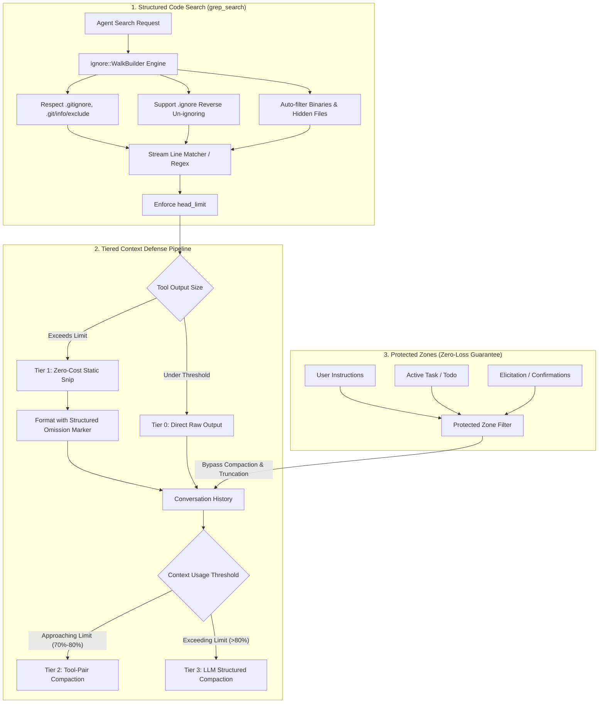

# Tiered Search & Context Compression in OpenDuck

## Overview

In large-scale codebases (e.g., Monorepos, Rust/C++ workspaces, and multi-package JavaScript/TypeScript repositories), agentic coding workflows often suffer from two critical pain points:
1. **Context Window Token Explosion**: Unbounded full-text search results, build logs, and file dumps consume tens of thousands of tokens in a single turn.
2. **Attention Dilution ("Lost in the Middle")**: Flooding the LLM context with hundreds of lines of minified assets, lockfiles, or irrelevant search matches degrades reasoning quality and increases hallucination rates.

To address these challenges, OpenDuck incorporates a **Tiered Search & Context Compression** architecture inspired by state-of-the-art AI agent harnesses (such as OpenCode). This system combines:
- **High-performance, rule-aware structured code search** (`grep_search`).
- **Multi-tiered context compression defense lines** (Tier 0 through Tier 3).
- **Zero-loss Protected Zones** for critical task states and user instructions.



---

## 1. Structured Code Search (`grep_search`)

Instead of relying on unstructured shell commands (e.g., raw `shell` running arbitrary `rg` or `grep` invocations that may omit bounds or fail across platforms), OpenDuck provides a dedicated `grep_search` tool within the `developer` platform extension.

### Key Capabilities

1. **Ripgrep Engine Integration**:
   - Built on Rust's `ignore::WalkBuilder` and `regex` crates.
   - Provides multi-threaded, parallel file traversal directly within the agent runtime without spawning external shell processes.
2. **Comprehensive Ignore Rules**:
   - Strictly respects `.gitignore`, `.git/info/exclude`, and global git configurations.
   - Automatically excludes VCS internal directories (e.g., `.git/`).
   - Automatically identifies and ignores binary files (via null-byte detection).
3. **`.ignore` Reverse Un-ignoring Support**:
   - If developers need the agent to inspect files or directories normally excluded by `.gitignore` (such as `node_modules/`, `dist/`, or vendor libraries), they can create an `.ignore` file in the project root with un-ignore syntax:
     ```gitignore
     # .ignore
     !node_modules/my-custom-package/
     !target/generated-sources/
     ```
   - OpenDuck's walker automatically prioritizes `.ignore` rules over `.gitignore`.
4. **Structured Parameters**:
   | Parameter | Type | Default | Description |
   | :--- | :--- | :--- | :--- |
   | `query` | `String` | *(Required)* | Search keyword or regular expression pattern. |
   | `path` | `Option<String>` | Workspace root | Target directory or file path to search within. |
   | `case_sensitive` | `Option<bool>` | `false` | Case-sensitive matching. |
   | `is_regex` | `Option<bool>` | `false` | Treat `query` as a regex pattern. |
   | `includes` | `Option<Vec<String>>` | `None` | Glob filter patterns (e.g., `["*.rs", "!**/tests/*"]`). |
   | `head_limit` | `Option<usize>` | `50` | Maximum matching lines to return (capped at 200). |
   | `context_lines` | `Option<usize>` | `0` | Number of context lines before/after match (0 to 5). |

5. **Head Limit & Structured Truncation**:
   When search results exceed `head_limit`, the output retains the first $N$ matches and appends an informative footer:
   ```text
   src/main.rs:12: pub fn start_service() {
   src/lib.rs:45: pub fn start_service() {
   
   [Found 84+ matches in 12 file(s). Showing first 50 matches (34+ omitted). Refine query or narrow search path.]
   ```

---

## 2. Multi-Tiered Context Compression

OpenDuck employs a 4-tier compression hierarchy to manage conversational context with minimal LLM overhead.

```
+-------------------------------------------------------------------------+
| Tier 0: Direct Raw Output (< 12 KB, <= 60 lines)                        |
+-------------------------------------------------------------------------+
                                    │ (Exceeds size/line bounds)
                                    ▼
+-------------------------------------------------------------------------+
| Tier 1: Zero-Cost String Snip (Head + Tail Retention + Omission Marker) |
+-------------------------------------------------------------------------+
                                    │ (Session history accumulates)
                                    ▼
+-------------------------------------------------------------------------+
| Tier 2: Tool-Pair Compaction (Selective historical tool fold/summary)   |
+-------------------------------------------------------------------------+
                                    │ (Context reaches threshold, e.g. 80%)
                                    ▼
+-------------------------------------------------------------------------+
| Tier 3: Global LLM Structured Compaction (StructuredSummary extraction) |
+-------------------------------------------------------------------------+
```

### Tier 0: Direct Raw Output
Outputs that are concise (below 12 KB and 60 lines) flow directly into the conversation stream without alteration, preserving maximal fidelity for short command returns.

### Tier 1: Zero-Cost Static Snip (`snip_tool_output`)
- **Location**: `crates/openduck-context-management/src/snip.rs`
- **Cost**: 0 tokens, 0 LLM calls, < 1ms CPU time.
- **Behavior**:
  - When tool output (such as large directory dumps or terminal logs) exceeds line or byte bounds, it retains the **head lines** (default 40 lines) and **tail lines** (default 10 lines).
  - Replaces the middle noise with an exact summary annotation:
    ```text
    [... 340 lines (18,420 bytes) snipped by OpenDuck context manager to save tokens ...]
    ```
  - Also applied in `format_message_for_compacting` so the summarizer model's prompt never explodes when historical turns contain massive tool outputs.

### Tier 2: Tool-Pair Compaction (`ToolPairCompactionOperation`)
- **Location**: `crates/openduck/src/agents/state_machine/ops_tool_pair_compaction.rs`
- **Behavior**:
  - Iterates through historical tool request/response pairs that are older than recent turns.
  - Automatically collapses completed tool cycles into compact inline summaries while preserving agent reasoning flow.

### Tier 3: Global LLM Structured Compaction (`compact_messages`)
- **Location**: `crates/openduck-context-management/src/lib.rs`
- **Behavior**:
  - Triggered automatically when conversation context token usage reaches the compaction threshold (configurable via `GOOSE_AUTO_COMPACT_THRESHOLD`, default `0.80`).
  - Distills entire conversation history into a strongly-typed `StructuredSummary` containing:
    - User Intent & Requirements
    - Technical Concepts & Architectural Decisions
    - Modified & Referenced Files Activity (`FileActivity`)
    - Errors Encountered and Applied Fixes
    - Current Work & Next Pending Tasks

---

## 3. Protected Zones Mechanism

To prevent aggressive compression from deleting vital mission parameters or active user constraints, OpenDuck enforces **Protected Zones** across all compression tiers:

```rust
pub fn is_protected_zone_message(msg: &Message) -> bool {
    // 1. User messages and prompt constraints are protected
    if matches!(msg.role, Role::User) {
        return true;
    }

    // 2. Action requests, elicitation responses, and system notifications are protected
    for content in &msg.content {
        match content {
            MessageContent::ActionRequired(_)
            | MessageContent::ToolConfirmationRequest(_)
            | MessageContent::SystemNotification(_) => return true,
            _ => {}
        }
    }

    false
}
```

### Guarantees
- **User Directives**: The original user prompt and recent user corrections are never discarded.
- **Active Tasks**: Task lists, Todo state, and required user confirmations remain intact.
- **Selective Eviction**: Only noisy, completed intermediary tool outputs (such as old grep results or compiler build spam) are pruned or summarized.

---

## 4. Developer Extension Guidelines

In `crates/openduck/src/agents/platform_extensions/developer/mod.rs`, system instructions guide the agent to favor structured tools:

> *"For editing software, prefer the flow of using tree to understand the codebase structure and file sizes. When you need to search code or files, prefer `grep_search` (which respects `.gitignore` and `.ignore` rules with head limits to prevent token blowout) over manual shell searches. Then use cat/read or edit to efficiently make changes."*

---

## 5. Configuration Reference

| Environment Variable / Config Key | Default | Description |
| :--- | :--- | :--- |
| `GOOSE_AUTO_COMPACT_THRESHOLD` | `0.8` (80%) | Ratio of context limit at which Tier 3 auto-compaction is triggered. |
| `GOOSE_TOOL_PAIR_SUMMARIZATION` | `true` | Enables/disables Tier 2 historical tool-pair compaction. |
| `DEFAULT_MAX_TOOL_OUTPUT_LINES` | `60` | Maximum lines before Tier 1 static Snip takes effect. |
| `DEFAULT_MAX_TOOL_OUTPUT_BYTES` | `12288` (12 KB) | Maximum bytes before Tier 1 static Snip takes effect. |

---

## 6. Verification and Testing

Automated test suites verify all layers of the search and compression pipeline:

```bash
# 1. Run developer::grep unit tests (head limit, .gitignore, .ignore reverse rules)
cargo test -p openduck --lib agents::platform_extensions::developer::grep

# 2. Run context management and Snip tests
cargo test -p openduck-context-management

# 3. Run full end-to-end grep integration tests
cargo test -p openduck --test grep_tests
```
