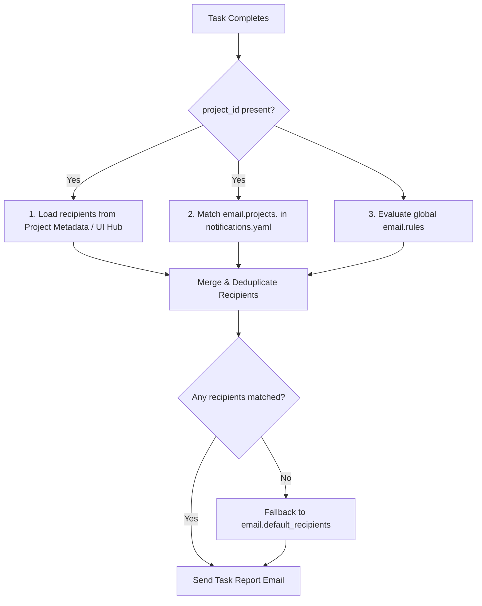

# Email Notifications & Project-Based Alerts

OpenDuck supports sending automated email notifications upon task completion, failure, or cancellation. Reports include execution status badges, duration, token usage metrics, final assistant responses, and detailed error tracebacks.

Notifications can be routed globally or on a **per-project basis**, ensuring that different engineering teams, on-call developers, or stakeholders receive alerts tailored to their workspaces.

---

## Key Capabilities

- **Project-Based Email Routing**: Route task execution reports directly to specific project teams based on the active project identifier (`project_id` / `slug`).
- **Flexible UI/Hub Management**:
  - **Hub Web Dashboard (`ui/hub`)**: View and edit email recipients in the project settings or when registering new projects.
  - **Desktop Hub & Settings (`ui/desktop`)**: Configure project alerts directly under the Chat Card or manage global SMTP settings in **Settings > Notifications**.
- **External Configuration File (`notifications.yaml`)**: Keep `config.yaml` clean by referencing an external `notifications.yaml` configuration file.
- **Rule-Based Triggers**: Send emails conditionally (`always`, `on_failure`, `on_success`, or by minimum execution duration).

---

## 1. Configuring via UI / Hub

### Project Settings in Hub Web (`ui/hub`)

In the OpenDuck Hub Web Dashboard:
1. Navigate to your project detail view and open the **Settings** tab.
2. Under **Project Email Notifications**, enter comma-separated email addresses:
   ```text
   dev@beiwanai.com, ops@beiwanai.com, zhanghu@beiwanai.com
   ```
3. Click **Save Email Recipients**. Any background task or scheduled job under this project will now dispatch completion reports to these addresses.

### Registering a New Project

When creating a new project in the Hub Dashboard (**Register Project** modal), you can optionally fill in the **Email Notification Recipients (Optional)** field to set up alerts immediately.

### Desktop App (`ui/desktop`)

- **Hub Landing Page**: A project notification bar is displayed under the Chat input. Click **[Edit Recipients]** or **[Set Email Alert]** to configure recipients for the current working directory.
- **Settings View**: Go to **Settings > Notifications** to configure your SMTP server connection, default fallback recipients, and inspect the project mapping table.

---

## 2. Configuration Files

### External Configuration File (`notifications.yaml`)

To avoid cluttering your primary `config.yaml`, specify the notifications configuration file path in `config.yaml`:

```yaml title="config.yaml"
# Reference the external notifications file
notifications: "notifications.yaml"
# or: notifications_file: "~/.config/openduck/notifications.yaml"
```

Then define your notification and SMTP settings in `notifications.yaml`:

```yaml title="notifications.yaml"
email:
  enabled: true
  smtp:
    host: "smtp.feishu.cn"
    port: 465
    use_tls: true
    username: "cc@beiwanai.com"
    password: "your_smtp_auth_password"
    from: "OpenDuck <cc@beiwanai.com>"
  
  # Default fallback recipients if no project-specific match is found
  default_recipients:
    - "zhanghu@beiwanai.com"

  # Project-specific recipient mappings
  projects:
    # Simple list format
    payment_service:
      - "payment-team@beiwanai.com"
      - "zhanghu@beiwanai.com"

    # Detailed rule-based format
    data_pipeline:
      recipients:
        - "data-eng@beiwanai.com"
      rules:
        - trigger_on: "on_failure"
          recipients:
            - "oncall-data@beiwanai.com"

  # Global notification rules
  rules:
    - trigger_on: "on_failure"
      recipients:
        - "zhanghu@beiwanai.com"
```

---

## 3. Configuration Schema Reference

### `email.smtp`

| Field | Type | Description | Default |
| :--- | :--- | :--- | :--- |
| `host` | `string` | SMTP server hostname (e.g. `smtp.feishu.cn`, `smtp.gmail.com`) | Required |
| `port` | `integer` | SMTP port (typically `465` for SSL/TLS, `587` for STARTTLS) | `465` |
| `use_tls` | `boolean` | Whether to establish TLS connection | `true` |
| `username` | `string` | SMTP authentication username / email | Optional |
| `password` | `string` | SMTP authentication password or App Password | Optional |
| `from` | `string` | Sender email header (e.g. `OpenDuck <bot@example.com>`) | Required |

### `email.projects`

Projects can be configured in two formats:

#### Array Format
```yaml
projects:
  my-project-slug:
    - "dev1@example.com"
    - "dev2@example.com"
```

#### Object Format
```yaml
projects:
  my-project-slug:
    recipients:
      - "team@example.com"
    rules:
      - trigger_on: "on_failure"
        min_duration_seconds: 60
        recipients:
          - "oncall@example.com"
```

---

## 4. Control REST API Integration

Project email recipients can also be managed programmatically through OpenDuck's Control REST API:

### Create Project (`POST /api/v1/projects`)
```http
POST /api/v1/projects HTTP/1.1
Content-Type: application/json

{
  "slug": "billing-engine",
  "title": "Billing Engine",
  "path": "/data/workspace/billing",
  "kind": "software",
  "status": "active",
  "emailRecipients": [
    "billing-devs@beiwanai.com",
    "zhanghu@beiwanai.com"
  ]
}
```

### Update Project Recipients (`PATCH /api/v1/projects/{slug}`)
```http
PATCH /api/v1/projects/billing-engine HTTP/1.1
Content-Type: application/json

{
  "emailRecipients": [
    "billing-oncall@beiwanai.com"
  ]
}
```

### Get Project Details (`GET /api/v1/projects/{slug}`)
Returns project metadata including `emailRecipients: string[]`.

---

## 5. Priority & Recipient Resolution

When a task completes, recipients are resolved in the following priority:


